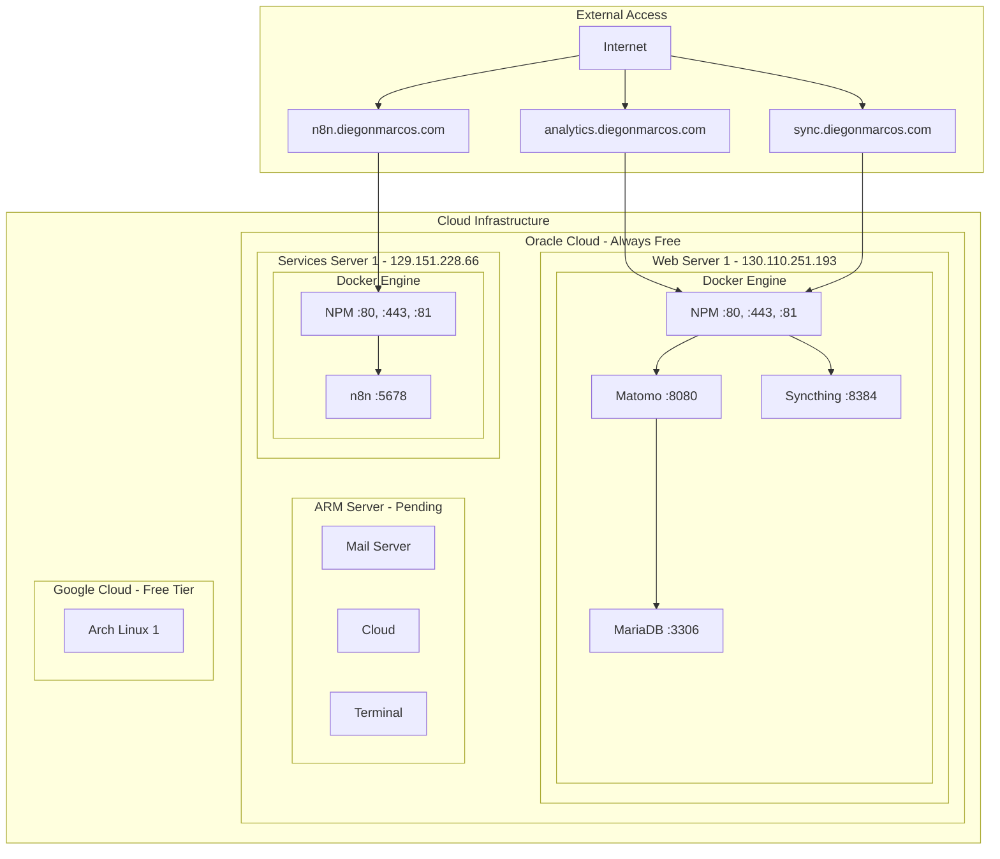
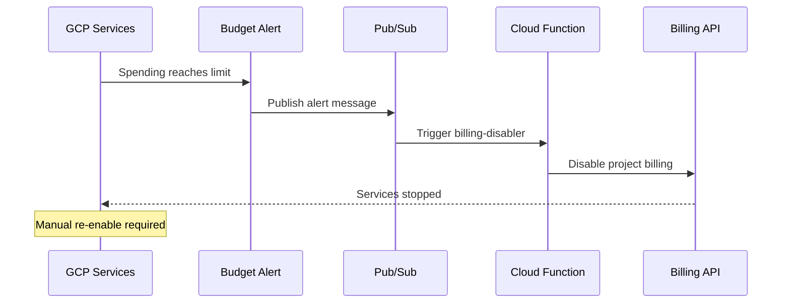

# Cloud Infrastructure Specification

> **Single Source of Truth**: `cloud-infrastructure.json`
> **Dashboard**: `cloud-dashboard.py` (TUI + Flask API)
> **Version**: 3.0.0 | **Updated**: 2025-12-03

---

## Table of Contents

1. [Quick Reference](#1-quick-reference)
2. [Infrastructure Overview](#2-infrastructure-overview)
3. [Virtual Machines](#3-virtual-machines)
4. [Services](#4-services)
5. [Network Architecture](#5-network-architecture)
6. [Docker Network Isolation](#6-docker-network-isolation)
7. [Security Architecture](#7-security-architecture)
8. [Volume & Storage Strategy](#8-volume--storage-strategy)
9. [Database Strategy](#9-database-strategy)
10. [SSH & Access Commands](#10-ssh--access-commands)
11. [Front-End Integration](#11-front-end-integration)
12. [Operations & Maintenance](#12-operations--maintenance)
13. [Diagrams](#13-diagrams)
14. [Authentication & Admin API](#14-authentication--admin-api)

---

## 1. Quick Reference

### Active Services
| Service ID | Display Name | URL | Status |
|------------|--------------|-----|--------|
| analytics-app | Matomo Analytics | https://analytics.diegonmarcos.com | on |
| sync-app | Syncthing | https://sync.diegonmarcos.com | on |
| n8n-infra-app | n8n (Infra) | https://n8n.diegonmarcos.com | on |
| cloud-app | Cloud Dashboard | https://cloud.diegonmarcos.com | on |

### Proxy Admin Panels
| Server | URL |
|--------|-----|
| Oracle Web Server 1 | http://130.110.251.193:81 |
| Oracle Services Server 1 | http://129.151.228.66:81 |

### Cloud Consoles
| Provider | URL |
|----------|-----|
| Oracle Cloud | https://cloud.oracle.com |
| Google Cloud | https://console.cloud.google.com |

### SSH Quick Commands
```bash
# Oracle Web Server 1 (Matomo, Syncthing)
ssh ubuntu@130.110.251.193

# Oracle Services Server 1 (n8n)
ssh ubuntu@129.151.228.66
```

---

## 2. Infrastructure Overview

```
+-------------------------------------------------------------------------+
|                        CLOUD INFRASTRUCTURE                              |
+-------------------------------------------------------------------------+
|                                                                          |
|  +-------------------------------------------------------------------+  |
|  |                    ORACLE CLOUD (Always Free)                      |  |
|  |                                                                    |  |
|  |  +-------------------------+    +-------------------------+        |  |
|  |  |  Oracle Web Server 1    |    |  Oracle Services Srv 1  |        |  |
|  |  |  130.110.251.193        |    |  129.151.228.66         |        |  |
|  |  |  VM.Standard.E2.1.Micro |    |  VM.Standard.E2.1.Micro |        |  |
|  |  |  1 OCPU | 1GB RAM       |    |  1 OCPU | 1GB RAM       |        |  |
|  |  |                         |    |                         |        |  |
|  |  |  Services:              |    |  Services:              |        |  |
|  |  |  - Matomo Analytics     |    |  - n8n Automation       |        |  |
|  |  |  - Syncthing            |    |  - NPM (proxy)          |        |  |
|  |  |  - NPM (proxy)          |    |                         |        |  |
|  |  |                         |    |  Status: ONLINE         |        |  |
|  |  |  Status: ONLINE         |    +-------------------------+        |  |
|  |  +-------------------------+                                       |  |
|  |                                                                    |  |
|  |  +-------------------------+                                       |  |
|  |  |  Oracle ARM Server      |    (VM.Standard.A1.Flex)              |  |
|  |  |  IP: pending            |    4 OCPU | 24GB RAM | 200GB          |  |
|  |  |                         |                                       |  |
|  |  |  Planned Services:      |    Status: CAPACITY WAITLIST          |  |
|  |  |  - Cloud (Nextcloud)    |                                       |  |
|  |  |  - Mail Server          |                                       |  |
|  |  |  - OS Terminal          |                                       |  |
|  |  +-------------------------+                                       |  |
|  |                                                                    |  |
|  |  +-------------------------+    +-------------------------+        |  |
|  |  |  ML VM1                 |    |  ML VM2                 |        |  |
|  |  |  IP: pending            |    |  IP: pending            |        |  |
|  |  |  Status: PLANNED        |    |  Status: PLANNED        |        |  |
|  |  +-------------------------+    +-------------------------+        |  |
|  +-------------------------------------------------------------------+  |
|                                                                          |
|  +-------------------------------------------------------------------+  |
|  |                    GOOGLE CLOUD (Free Tier)                        |  |
|  |                                                                    |  |
|  |  +-------------------------+                                       |  |
|  |  |  GCloud Arch Linux 1    |    (e2-micro)                         |  |
|  |  |  IP: pending            |    0.25-2 vCPU | 1GB RAM              |  |
|  |  |                         |                                       |  |
|  |  |  Status: PENDING        |                                       |  |
|  |  +-------------------------+                                       |  |
|  +-------------------------------------------------------------------+  |
|                                                                          |
+-------------------------------------------------------------------------+
```

---

## 3. Virtual Machines

### 3.1 VM Categories

| Category | Description |
|----------|-------------|
| **Services** | General purpose VMs for web services and applications |
| **Machine Learning** | VMs dedicated to ML workloads and automation |

### 3.2 Services VMs

#### Oracle Web Server 1
| Property | Value |
|----------|-------|
| **ID** | oracle-web-server-1 |
| **Provider** | Oracle Cloud |
| **IP** | 130.110.251.193 |
| **Type** | VM.Standard.E2.1.Micro |
| **Specs** | 1 OCPU (AMD), 1GB RAM, 47GB Boot |
| **OS** | Ubuntu 24.04 LTS |
| **Services** | Matomo, Syncthing, NPM |
| **Ports** | 22, 80, 443, 81, 22000, 21027 |
| **Status** | Active |

#### Oracle Services Server 1
| Property | Value |
|----------|-------|
| **ID** | oracle-services-server-1 |
| **Provider** | Oracle Cloud |
| **IP** | 129.151.228.66 |
| **Type** | VM.Standard.E2.1.Micro |
| **Specs** | 1 OCPU (AMD), 1GB RAM, 47GB Boot |
| **OS** | Ubuntu 24.04 LTS |
| **Services** | n8n, NPM |
| **Ports** | 22, 80, 443, 81 |
| **Status** | Active |

#### GCloud Arch Linux 1
| Property | Value |
|----------|-------|
| **ID** | gcloud-arch-1 |
| **Provider** | Google Cloud |
| **IP** | pending |
| **Type** | e2-micro |
| **Specs** | 0.25-2 vCPU, 1GB RAM, 30GB |
| **OS** | Arch Linux (rolling) |
| **Status** | Pending |

### 3.3 Machine Learning VMs

#### Oracle ARM Server
| Property | Value |
|----------|-------|
| **ID** | oracle-arm-server |
| **Provider** | Oracle Cloud |
| **IP** | pending |
| **Type** | VM.Standard.A1.Flex |
| **Specs** | 4 OCPU (ARM64 Ampere), 24GB RAM, 200GB |
| **OS** | Ubuntu 24.04 LTS |
| **Planned Services** | Cloud, Mail, Terminal, Dashboard |
| **Status** | Capacity Waitlist |

#### ML VM1 & ML VM2
| Property | Value |
|----------|-------|
| **Status** | Planned |
| **Purpose** | Future ML workloads |

---

## 4. Services

### 4.1 Service Categories

| Category | Description |
|----------|-------------|
| **Infrastructure** | Core infrastructure services (storage, proxy) |
| **Productivity** | Productivity and communication tools |
| **Web** | Web analytics and monitoring |
| **Machine Learning** | ML and automation services |

### 4.2 Service Resource Requirements

| Status | Service ID | Category | RAM (Avg) | Storage (Avg) | Bandwidth (Avg) | Notes |
|--------|------------|----------|-----------|---------------|-----------------|-------|
| | **n8n-ai** | ML | | | | AI Agentic workflows |
| hold | ↳ n8n-ai-app | | 1-4 GB | 2-10 GB | 5-20 GB/mo | LLM context + workflows |
| hold | ↳ n8n-ai-db | | 256-512 MB | 1-10 GB | - | PostgreSQL - varies by usage |
| | **mail** | Productivity | | | | Email stack |
| dev | ↳ mail-app | | 512 MB - 1 GB | 5-50 GB | 1-10 GB/mo | Mailboxes + indexes |
| dev | ↳ mail-db | | 8-32 MB | Variable | - | SQLite embedded |
| | **analytics** | Web | | | | Matomo Analytics platform |
| on | ↳ analytics-app | | 256-512 MB | 2-5 GB | 500 MB-2 GB/mo | PHP FPM Alpine |
| on | ↳ analytics-db | | 256-512 MB | 1-10 GB | - | MariaDB - grows with data |
| | **git** | Productivity | | | | Gitea hosting |
| dev | ↳ git-app | | 256-512 MB | 1-5 GB | 2-10 GB/mo | Web + Git server |
| dev | ↳ git-db | | 8-32 MB | Variable | - | SQLite embedded |
| dev | ↳ git-repos | | - | ~10 GB | - | Git repositories storage |
| | **n8n-infra** | Automation | | | | Workflow automation |
| on | ↳ n8n-infra-app | | 256-512 MB | 500 MB - 2 GB | 1-5 GB/mo | Workflows + execution logs |
| | **sync** | Productivity | | | | Syncthing file sync |
| on | ↳ sync-app | | 128-256 MB | 100-500 MB | 10-50 GB/mo | App + config |
| on | ↳ sync-index-db | | - | 100-500 MB | - | File metadata index |
| on | ↳ sync-files-db | | - | ~100 GB | - | Synced files storage |
| on | ↳ sync-obj-db | | - | ~5 GB | - | Object/blob storage |
| | **npm** | Infrastructure | | | | Reverse proxy (4 instances) |
| on | ↳ npm-oracle-web | | 128-256 MB | 100-500 MB | 5-20 GB/mo | SSL certs + configs |
| on | ↳ npm-oracle-services | | 128-256 MB | 100-500 MB | 5-20 GB/mo | SSL certs + configs |
| hold | ↳ npm-oracle-arm | | 128-256 MB | 100-500 MB | 5-20 GB/mo | SSL certs + configs |
| dev | ↳ npm-gcloud | | 128-256 MB | 100-500 MB | 5-20 GB/mo | SSL certs + configs |
| | **cache** | Cache | | | | Redis in-memory store |
| dev | ↳ cache-app | | 64-256 MB | 100 MB - 1 GB | - | Session/cache data |
| | **vpn** | Infrastructure | | | | OpenVPN server |
| dev | ↳ vpn-app | | 64-128 MB | 50-100 MB | 5-50 GB/mo | Client configs + certs |
| | **cloud** | Coder | | | | Cloud Dashboard |
| on | ↳ cloud-app | | - | 5 MB | 50-200 MB/mo | Static HTML/CSS/JS |
| dev | ↳ cloud-api | | 64-128 MB | 50-100 MB | 100-500 MB/mo | Flask API server |
| dev | ↳ cloud-db | | 8-32 MB | 50-200 MB | - | SQLite or PostgreSQL |
| | **terminal** | Productivity | | | | Web terminal |
| dev | ↳ terminal-app | | 64-128 MB | 50-100 MB | 500 MB-2 GB/mo | wetty/ttyd session-based |
| | **Total ON** | | **~1-1.8 GB** | **~8-23 GB** | **~17-77 GB/mo** | Active services |
| | **Total DEV** | | **~2-5.7 GB** | **~122-182 GB** | **~14-92 GB/mo** | In development |
| | **TOTAL** | | **~3-7.5 GB** | **~130-205 GB** | **~31-169 GB/mo** | All services combined |


**VM Totals (Estimated)**:

| Status | VM | Services | Total RAM (Est) | Total Storage (Est) | Bandwidth (Est) |
|--------|-----|----------|-----------------|---------------------|-----------------|
| on | Oracle Web Server 1 | n8n-infra-app, sync-app, cloud-app, cloud-api, npm-oracle-web, vpn-app, git-app, cache-app | ~800 MB - 1.5 GB | ~5-15 GB | ~20-80 GB/mo |
| on | Oracle Services Server 1 | analytics-app, analytics-db, cloud-db, npm-oracle-services | ~600 MB - 1.2 GB | ~5-15 GB | ~5-20 GB/mo |
| hold | Oracle ARM Server | n8n-ai-app, n8n-ai-db, npm-oracle-arm | ~1.5-5 GB | ~5-20 GB | ~10-40 GB/mo |
| dev | GCloud Arch 1 | mail-app, mail-db, terminal-app, npm-gcloud | ~800 MB - 1.5 GB | ~10-50 GB | ~5-15 GB/mo |
| | **Total ON** | | **~1.4-2.7 GB** | **~10-30 GB** | **~25-100 GB/mo** |
| | **Total DEV** | | **~2.3-6.5 GB** | **~15-70 GB** | **~15-55 GB/mo** |
| | **TOTAL** | | **~3.7-9.2 GB** | **~25-100 GB** | **~40-155 GB/mo** |

---

### 4.3 Infrastructure Services

#### NPM (Web Server)
| Property | Value |
|----------|-------|
| **VM** | Oracle Web Server 1 |
| **Admin URL** | http://130.110.251.193:81 |
| **Technology** | jc21/nginx-proxy-manager |
| **Features** | SSL termination, Let's Encrypt, Access lists |
| **Status** | Active |

#### NPM (Services Server)
| Property | Value |
|----------|-------|
| **VM** | Oracle Services Server 1 |
| **Admin URL** | http://129.151.228.66:81 |
| **Technology** | jc21/nginx-proxy-manager |
| **Status** | Active |

#### Cloud
| Property | Value |
|----------|-------|
| **Domain** | cloud.diegonmarcos.com |
| **Technology** | GitHub Pages (static) |
| **Status** | Active |

### 4.4 Web Services

#### Matomo Analytics
| Property | Value |
|----------|-------|
| **VM** | Oracle Web Server 1 |
| **Domain** | analytics.diegonmarcos.com |
| **Internal Port** | 8080 |
| **Technology** | matomo:fpm-alpine + mariadb:11.4 |
| **Container** | matomo-app, matomo-db |
| **Features** | Anti-blocker proxy, Tag Manager, Custom events |
| **Status** | Active |

### 4.5 Machine Learning Services

#### n8n Automation
| Property | Value |
|----------|-------|
| **VM** | Oracle Services Server 1 |
| **Domain** | n8n.diegonmarcos.com |
| **Internal Port** | 5678 |
| **Technology** | n8nio/n8n |
| **Container** | n8n |
| **Features** | Workflow automation, 400+ integrations, Webhooks |
| **Status** | Active |

### 4.6 Productivity Services

#### Syncthing
| Property | Value |
|----------|-------|
| **VM** | Oracle Web Server 1 |
| **Domain** | sync.diegonmarcos.com |
| **Internal Port** | 8384 |
| **Sync Port** | 22000/TCP, 21027/UDP |
| **Technology** | syncthing/syncthing |
| **Container** | syncthing |
| **Status** | Active |

#### Mail Server
| Property | Value |
|----------|-------|
| **VM** | Oracle ARM Server (planned) |
| **Domain** | mail.diegonmarcos.com |
| **Technology** | docker-mailserver |
| **Features** | DKIM, SPF, DMARC, Fail2Ban |
| **Status** | Development |

#### OS Terminal Web
| Property | Value |
|----------|-------|
| **VM** | Oracle ARM Server (planned) |
| **Technology** | wetty or ttyd |
| **Status** | Development |

---

## 5. Network Architecture

### 5.1 Traffic Flow

```
+-------------------------------------------------------------------------+
|                              INTERNET                                    |
|    HTTP(80) | HTTPS(443) | SSH(22) | SMTP(25,587) | IMAP(993)           |
+------+------+------+------+----+----+------+-------+------+--------------+
       |            |           |           |              |
       v            v           v           v              v
+-------------------------------------------------------------------------+
|                    UFW FIREWALL (Default: DROP)                          |
|   OK: 22/tcp  OK: 80/tcp  OK: 443/tcp  OK: 25/tcp  OK: 587/tcp          |
|   OK: 993/tcp  BLOCKED: 8080  BLOCKED: 3306  BLOCKED: 5432              |
+------+----------------+----------+----------------+----------------------+
       |                |          |                |
       |                v          |                v
       |      +-----------------+  |      +-----------------+
       |      |  NGINX PROXY    |  |      |   MAIL SERVER   |
       |      |  (Host Level)   |  |      |   (Docker)      |
       |      |  Listen: 80,443 |  |      |   Listen: 25,   |
       |      +--------+--------+  |      |   587, 993      |
       |               |           |      +-----------------+
       |               v           |
       |      +--------------------------------------+
       |      |         DOCKER ENVIRONMENT          |
       |      |  +------------+  +------------+     |
       |      |  | PUBLIC     |  | PRIVATE    |     |
       |      |  | NETWORK    |  | NETWORK    |     |
       |      |  | :8080      |  | :8082      |     |
       |      |  | :8081      |  | internal   |     |
       |      |  +------------+  +------------+     |
       |      +--------------------------------------+
       |
       v
+-----------------+
|   HOST OS       |
|   (SSH Direct)  |
|   Ubuntu 24.04  |
+-----------------+
```

### 5.2 External Ports (Internet-Facing)

| Port | Protocol | Service | VM |
|------|----------|---------|-----|
| 22 | TCP | SSH | All |
| 80 | TCP | HTTP (redirect to HTTPS) | All |
| 443 | TCP | HTTPS | All |
| 81 | TCP | NPM Admin | Web Server 1, Services Server 1 |
| 22000 | TCP | Syncthing Sync | Web Server 1 |
| 21027 | UDP | Syncthing Discovery | Web Server 1 |

### 5.3 Internal Ports (localhost only, proxied via NPM)

| Port | Service | VM |
|------|---------|-----|
| 8080 | Matomo | Web Server 1 |
| 8384 | Syncthing GUI | Web Server 1 |
| 5678 | n8n | Services Server 1 |
| 3306 | MariaDB | Web Server 1 |

### 5.4 Key Design Decisions

1. **NGINX on Host (not Docker)**
   - SSL termination at host level
   - Direct access to Let's Encrypt
   - Survives container restarts

2. **Localhost Binding**
   - All containers bind to `127.0.0.1:port`
   - Prevents Docker UFW bypass vulnerability
   - Internet cannot reach containers directly

3. **SSH Direct Path**
   - SSH bypasses NGINX and Docker
   - Direct access to host OS
   - Emergency access even if containers fail

---

## 6. Docker Network Isolation

### 6.1 Network Topology

```yaml
networks:
  # Public services - internet accessible via NGINX
  public_net:
    driver: bridge
    subnet: 172.20.0.0/24
    purpose: Public services accessible via NGINX

  # Private services - requires authentication
  private_net:
    driver: bridge
    internal: true  # No external access
    subnet: 172.21.0.0/24
    purpose: Private services requiring authentication

  # Mail services - isolated email stack
  mail_net:
    driver: bridge
    subnet: 172.22.0.0/24
    purpose: Isolated email stack

  # Database bridge - backup agent only
  db_bridge:
    driver: bridge
    internal: true
    subnet: 172.23.0.0/24
    purpose: Database backup agent access
```

### 6.2 Network Membership Matrix

| Container | public_net | private_net | mail_net | db_bridge |
|-----------|:----------:|:-----------:|:--------:|:---------:|
| web-server | X | | | |
| matomo-app | X | | | |
| matomo-db | X | | | X |
| nextcloud-app | | X | | |
| nextcloud-db | | X | | X |
| redis | | X | | |
| mailserver | | | X | |
| mail-db | | | X | X |
| backup-agent | | | | X |

### 6.3 Isolation Verification

```bash
# From matomo-app, verify cannot reach private network
docker exec matomo-app ping -c 1 172.21.0.2  # Should fail

# From nextcloud-app, verify cannot reach public network
docker exec nextcloud-app ping -c 1 172.20.0.2  # Should fail

# Verify internal network has no external access
docker exec nextcloud-db curl -s http://google.com  # Should fail
```

---

## 7. Security Architecture

### 7.1 Architecture Philosophy

**"Blast Radius Containment"** - Assume any public-facing service can be compromised. Design the infrastructure so that a breach in one service cannot spread to others.

### 7.2 Defense in Depth Model

```
Layer 1: Network Edge
├── Oracle Cloud Security Lists
├── UFW Firewall (host level)
└── Fail2Ban (brute force protection)

Layer 2: Traffic Routing
├── NGINX TLS termination
├── HTTP → HTTPS redirect
├── Rate limiting
└── Security headers

Layer 3: Application Isolation
├── Docker networks (no cross-talk)
├── Container user namespaces
├── Read-only filesystems
└── Resource limits (CPU, memory)

Layer 4: Data Protection
├── Separate volumes per service
├── LUKS encryption at rest
├── Database per service
└── Backup encryption
```

### 7.3 UFW Configuration

```bash
# Reset to defaults
sudo ufw --force reset
sudo ufw default deny incoming
sudo ufw default allow outgoing

# Allow specific ports
sudo ufw allow 22/tcp comment 'SSH'
sudo ufw allow 80/tcp comment 'HTTP redirect'
sudo ufw allow 443/tcp comment 'HTTPS'
sudo ufw allow 25/tcp comment 'SMTP'
sudo ufw allow 587/tcp comment 'SMTP Submission'
sudo ufw allow 993/tcp comment 'IMAPS'

# Enable firewall
sudo ufw enable
sudo ufw status verbose
```

### 7.4 SSH Hardening

```bash
# /etc/ssh/sshd_config
PermitRootLogin no
PasswordAuthentication no
PubkeyAuthentication yes
MaxAuthTries 3
AllowUsers ubuntu
```

### 7.5 NGINX Security Headers

```nginx
# /etc/nginx/conf.d/security.conf
add_header Strict-Transport-Security "max-age=31536000; includeSubDomains" always;
add_header X-Content-Type-Options "nosniff" always;
add_header X-Frame-Options "SAMEORIGIN" always;
add_header X-XSS-Protection "1; mode=block" always;
add_header Referrer-Policy "strict-origin-when-cross-origin" always;
```

### 7.6 Docker Hardening

```yaml
services:
  web-server:
    security_opt:
      - no-new-privileges:true
    read_only: true
    tmpfs:
      - /tmp
    deploy:
      resources:
        limits:
          cpus: '0.5'
          memory: 256M
```

---

## 8. Volume & Storage Strategy

### 8.1 Storage Partitions (ARM Server - Future)

```
Host Filesystem:
├── / (Boot Volume - 47GB)
│   ├── /etc/nginx/          # NGINX configs
│   ├── /opt/docker/         # Docker compose files
│   └── /home/ubuntu/        # User home
│
├── /mnt/public (Block Volume 1 - 50GB)
│   ├── matomo-db/           # MariaDB data
│   ├── matomo-files/        # Matomo uploads
│   └── web-static/          # Static website files
│
├── /mnt/private (Block Volume 2 - 50GB) [LUKS ENCRYPTED]
│   ├── nextcloud-db/        # PostgreSQL data
│   ├── nextcloud-files/     # User files
│   └── redis-data/          # Persistent cache
│
└── /mnt/mail (Block Volume 3 - 50GB) [LUKS ENCRYPTED]
    ├── mailboxes/           # Maildir storage
    ├── mail-config/         # Server configuration
    └── dkim-keys/           # DKIM signing keys
```

### 8.2 LUKS Encryption Setup

```bash
# Create encrypted partition
sudo cryptsetup luksFormat /dev/sdb1
sudo cryptsetup open /dev/sdb1 private_crypt

# Format and mount
sudo mkfs.ext4 /dev/mapper/private_crypt
sudo mount /dev/mapper/private_crypt /mnt/private

# Auto-unlock at boot (with keyfile)
sudo dd if=/dev/urandom of=/root/.luks-keyfile bs=4096 count=1
sudo chmod 400 /root/.luks-keyfile
sudo cryptsetup luksAddKey /dev/sdb1 /root/.luks-keyfile

# /etc/crypttab
private_crypt /dev/sdb1 /root/.luks-keyfile luks
```

---

## 9. Database Strategy

### 9.1 SQL vs NoSQL Decision Matrix

| Use Case | Type | Database | Reason |
|----------|------|----------|--------|
| Analytics (Matomo) | SQL | MariaDB | Complex queries, time-series |
| User Files (NextCloud) | SQL | PostgreSQL | Metadata, relations |
| Mail Accounts | SQL | SQLite | Simple, lightweight |
| Session Cache | NoSQL | Redis | Fast, ephemeral |
| Search Index | NoSQL | Redis | Key-value lookups |
| Email Storage | Files | Maildir | Standard format |

### 9.2 Isolation Rule

```
+-------------------------------------------------------------+
|                    RULE: ONE DB PER SERVICE                  |
|                                                              |
|  WRONG: Single MariaDB for Matomo + NextCloud               |
|  RIGHT: Separate MariaDB (Matomo) + PostgreSQL (NC)         |
|                                                              |
|  Reason: Prevents privilege escalation between services     |
+-------------------------------------------------------------+
```

---

## 10. SSH & Access Commands

### 10.1 SSH Access

```bash
# Oracle Web Server 1 (Matomo, Syncthing)
ssh ubuntu@130.110.251.193

# Oracle Services Server 1 (n8n)
ssh ubuntu@129.151.228.66

# Google Cloud (when active)
gcloud compute ssh arch-1 --zone us-central1-a
```

### 10.2 Docker Commands (after SSH)

```bash
# View all containers
sudo docker ps

# View logs
sudo docker logs --tail 100 matomo-app
sudo docker logs --tail 100 -f matomo-db

# Execute shell in container
sudo docker exec -it matomo-app bash
sudo docker exec -it matomo-db bash
sudo docker exec -it syncthing sh
sudo docker exec -it n8n sh

# Restart container
sudo docker restart matomo-app

# View resource usage
sudo docker stats --no-stream
```

### 10.3 System Commands

```bash
# Disk usage
df -h

# Memory usage
free -h

# Check swap
swapon --show

# Create swap (if needed - for 1GB VMs)
sudo fallocate -l 1G /swapfile
sudo chmod 600 /swapfile
sudo mkswap /swapfile
sudo swapon /swapfile
echo '/swapfile none swap sw 0 0' | sudo tee -a /etc/fstab
```

---

## 11. Front-End Integration

### 11.1 Data Source

The front-end dashboard reads from `cloud-infrastructure.json`:

- **Services list** → `services` object
- **VM cards** → `virtualMachines` object
- **Provider cards** → `providers` object
- **URLs & commands** → Each service/VM contains its URLs
- **Status indicators** → `status` field on each entity

### 11.2 JSON Structure Overview

```json
{
  "providers": {
    "oracle": { "consoleUrl": "...", "cli": {...} },
    "gcloud": { "consoleUrl": "...", "cli": {...} }
  },
  "vmCategories": {
    "services": { "name": "Services", "description": "..." },
    "ml": { "name": "Machine Learning", "description": "..." }
  },
  "virtualMachines": {
    "oracle-web-server-1": { "ip": "...", "ssh": {...}, "services": [...] },
    "oracle-services-server-1": { "ip": "...", "ssh": {...}, "services": [...] }
  },
  "serviceCategories": {
    "infra": { "name": "Infrastructure" },
    "productivity": { "name": "Productivity" },
    "web": { "name": "Web" },
    "ml": { "name": "Machine Learning" }
  },
  "services": {
    "matomo": { "urls": {...}, "docker": {...}, "status": "active" },
    "n8n": { "urls": {...}, "docker": {...}, "status": "active" }
  },
  "domains": { "primary": "diegonmarcos.com", "subdomains": {...} },
  "firewallRules": { "oracle-web-server-1": [...] }
}
```

### 11.3 TypeScript Types (suggested)

```typescript
interface CloudInfrastructure {
  providers: Record<string, Provider>;
  vmCategories: Record<string, VMCategory>;
  virtualMachines: Record<string, VirtualMachine>;
  serviceCategories: Record<string, ServiceCategory>;
  services: Record<string, Service>;
  domains: DomainConfig;
  firewallRules: Record<string, FirewallRule[]>;
  dockerNetworks: Record<string, DockerNetwork>;
  quickCommands: QuickCommands;
}
```

### 11.4 Front-End Card Mapping

| Card | JSON Path | Click Action |
|------|-----------|--------------|
| Matomo Analytics | `services.matomo` | Open `urls.gui` |
| Syncthing | `services.syncthing` | Open `urls.gui` |
| n8n Automation | `services.n8n` | Open `urls.gui` |
| Oracle Cloud | `providers.oracle` | Open `consoleUrl` |
| Google Cloud | `providers.gcloud` | Open `consoleUrl` |

### 11.5 Status Values

| Status | Display | Card Style | Description |
|--------|---------|------------|-------------|
| `on` | Online | Green indicator | Running and accessible |
| `dev` | In Development | Blue indicator | Under active development |
| `hold` | On Hold | Yellow/Orange indicator | Waiting for resources |
| `tbd` | To Be Determined | Gray indicator | Planned for future |

### 11.6 Naming Convention

All services follow a consistent naming pattern:

| Pattern | Example | Description |
|---------|---------|-------------|
| `{service}-app` | `analytics-app`, `sync-app` | Application/service container |
| `{service}-db` | `analytics-db`, `git-db` | Database container |
| `npm-{provider}-{vm}` | `npm-oracle-web`, `npm-gcloud` | NPM proxy per VM |
| `n8n-{type}-app` | `n8n-infra-app`, `n8n-ai-app` | n8n workflow variants |

---

## 12. Operations & Maintenance

### 12.1 Daily Operations

```bash
# Check service health
docker ps --format "table {{.Names}}\t{{.Status}}\t{{.Ports}}"

# View logs
docker logs --tail 100 matomo-app
docker logs --tail 100 -f mailserver

# Check disk usage
df -h /mnt/*
docker system df
```

### 12.2 Weekly Operations

```bash
# Update containers
docker compose pull
docker compose up -d

# Clean old images
docker image prune -a --filter "until=168h"

# Verify backups
ls -la /backup/
```

### 12.3 Monthly Operations

```bash
# OS updates
sudo apt update && sudo apt upgrade -y

# SSL certificate check
sudo certbot certificates

# Review firewall rules
sudo ufw status verbose

# Audit Docker networks
docker network ls
docker network inspect public_net
```

### 12.4 Dashboard Usage

The unified `cloud-dashboard.py` provides three modes: TUI, API Server, and CLI.

```bash
# Launch interactive TUI dashboard
python cloud-dashboard.py

# Start Flask API server (for web dashboard)
python cloud-dashboard.py serve
python cloud-dashboard.py serve --debug

# Quick CLI status check
python cloud-dashboard.py status

# Help
python cloud-dashboard.py help
```

#### API Endpoints (when running `serve`)

| Endpoint | Description |
|----------|-------------|
| `GET /api/health` | API health check |
| `GET /api/vms` | List all VMs |
| `GET /api/vms/<id>` | Get VM details |
| `GET /api/vms/<id>/status` | VM health status (ping, SSH) |
| `GET /api/vms/<id>/containers` | Docker containers on VM |
| `GET /api/services` | List all services |
| `GET /api/services/<id>` | Get service details |
| `GET /api/services/<id>/status` | Service health status (HTTP check) |
| `GET /api/dashboard/summary` | Full dashboard with health checks |
| `GET /api/dashboard/quick-status` | Quick status (config only, no checks) |
| `GET /api/config` | Full JSON configuration |
| `POST /api/config/reload` | Reload configuration from disk |

#### TUI Commands

| Key | Action |
|-----|--------|
| `1` | VM Details |
| `2` | Container Status |
| `3` | Reboot VM |
| `4` | Restart Container |
| `5` | View Logs |
| `6` | Stop/Start Container |
| `7` | SSH to VM |
| `8` | Open URL |
| `S` | Quick Status |
| `R` | Refresh |
| `Q` | Quit |

### 12.5 Incident Response

**If container compromised**:
```bash
# 1. Isolate container
docker network disconnect public_net compromised-container
docker stop compromised-container

# 2. Preserve evidence
docker commit compromised-container evidence:$(date +%s)
docker logs compromised-container > /tmp/incident-logs.txt

# 3. Restore from backup
docker compose down compromised-service
rm -rf /mnt/public/compromised-data/*
# Restore from backup...
docker compose up -d compromised-service

# 4. Post-incident
# - Review logs
# - Update passwords
# - Patch vulnerabilities
# - Update monitoring
```

---

## 13. Diagrams

### 13.1 High-Level Service Flow

```
User Request
     |
     v
+-----------+
|    DNS    | analytics.diegonmarcos.com → 130.110.251.193
+-----+-----+
      |
      v
+-----------+
| NPM (:443)| SSL Termination + Routing
+-----+-----+
      |
      v
+-----------+
|  Matomo   | localhost:8080 (Docker)
|  (:8080)  |
+-----------+
```

### 13.2 Mermaid: Infrastructure Tree



### 13.3 Mermaid: Budget Protection Flow (GCloud)



---

## 14. Authentication & Admin API

### 14.1 Overview

The dashboard supports **GitHub OAuth 2.0** authentication for admin operations. Public endpoints (status, health) remain unauthenticated. Admin endpoints (reboot, restart, stop/start) require login.

### 14.2 Authentication Flow

```
+------------------+     +------------------+     +------------------+
|   Dashboard UI   |     |   Flask API      |     |   GitHub OAuth   |
+--------+---------+     +--------+---------+     +--------+---------+
         |                        |                        |
         | 1. Click "Login"       |                        |
         |----------------------->|                        |
         |                        | 2. Redirect to GitHub  |
         |                        |----------------------->|
         |                        |                        |
         |                        | 3. User authorizes     |
         |                        |<-----------------------|
         |                        |                        |
         | 4. Return JWT token    |                        |
         |<-----------------------|                        |
         |                        |                        |
         | 5. Admin commands      |                        |
         | (with Bearer token)    |                        |
         |----------------------->|                        |
         |                        |                        |
```

### 14.3 Endpoint Access Levels

| Access Level | Endpoints | Auth Required |
|--------------|-----------|---------------|
| **Public** | `/api/health`, `/api/vms`, `/api/services`, `/api/dashboard/*` | No |
| **Admin** | `/api/admin/vms/*/reboot`, `/api/admin/vms/*/containers/*/restart` | Yes (JWT) |

### 14.4 Admin API Endpoints

| Endpoint | Method | Description | Auth |
|----------|--------|-------------|------|
| `POST /api/auth/github` | POST | Initiate GitHub OAuth flow | No |
| `GET /api/auth/callback` | GET | GitHub OAuth callback | No |
| `GET /api/auth/me` | GET | Get current user info | Yes |
| `POST /api/auth/logout` | POST | Invalidate session | Yes |
| `POST /api/admin/vms/<id>/reboot` | POST | Reboot VM via SSH | Yes |
| `POST /api/admin/vms/<id>/containers/<name>/restart` | POST | Restart Docker container | Yes |
| `POST /api/admin/vms/<id>/containers/<name>/stop` | POST | Stop Docker container | Yes |
| `POST /api/admin/vms/<id>/containers/<name>/start` | POST | Start Docker container | Yes |
| `POST /api/admin/services/<id>/restart` | POST | Restart service (container) | Yes |

### 14.5 GitHub OAuth Configuration

```bash
# Required environment variables
GITHUB_CLIENT_ID=your_client_id
GITHUB_CLIENT_SECRET=your_client_secret
JWT_SECRET_KEY=your_jwt_secret
ALLOWED_GITHUB_USERS=diegonmarcos  # Comma-separated usernames
```

GitHub App settings:
- **Authorization callback URL**: `https://cloud.diegonmarcos.com/api/auth/callback`
- **Scopes**: `read:user` (only need username verification)

### 14.6 Dashboard UI Changes

**Before Login:**
```
+------------------------------------------+
|  Cloud Dashboard            [Login] btn  |
+------------------------------------------+
|  VMs        | Services                   |
|  - Status   | - Status                   |
|  (read-only)| (read-only)                |
+------------------------------------------+
```

**After Login:**
```
+------------------------------------------+
|  Cloud Dashboard    [diego] [Logout] btn |
+------------------------------------------+
|  VMs                | Services           |
|  - Status           | - Status           |
|  - [Reboot] btn     | - [Restart] btn    |
|  - [Containers]     | - [Stop/Start]     |
|    - [Restart]      |                    |
|    - [Stop/Start]   |                    |
+------------------------------------------+
```

### 14.7 Security Considerations

1. **JWT Expiration**: Tokens expire after 24 hours
2. **Username Whitelist**: Only `ALLOWED_GITHUB_USERS` can access admin endpoints
3. **HTTPS Only**: OAuth flow requires HTTPS
4. **CSRF Protection**: State parameter in OAuth flow
5. **Rate Limiting**: Admin endpoints rate-limited to prevent abuse
6. **Audit Logging**: All admin actions logged with timestamp and user

### 14.8 Implementation Status

| Component | Status |
|-----------|--------|
| GitHub OAuth flow | `dev` |
| JWT token generation | `dev` |
| Admin endpoints | `dev` |
| Dashboard UI (login button) | `dev` |
| Dashboard UI (admin controls) | `dev` |

---

## Changelog

| Date | Change |
|------|--------|
| 2025-12-04 | **v3.1.0** - Added OAuth 2.0 (GitHub) authentication spec for admin endpoints |
| 2025-12-03 | **v3.0.0** - Unified cloud-dashboard.py (TUI + Flask API in single file) |
| 2025-12-03 | Established naming convention: `{service}-app`, `{service}-db`, `npm-{provider}-{vm}` |
| 2025-12-03 | New status values: `on`, `dev`, `hold`, `tbd` (replaces active/pending/development/planned) |
| 2025-12-03 | Added `displayName` field for human-readable service names |
| 2025-12-03 | Created Cloud-spec_Tables.md with architecture reference tables |
| 2025-12-02 | Consolidated HANDOFF.md, spec_infra.md, SPEC.md, VPS_ARCHITECTURE_SPEC.md into single CLOUD-SPEC.md |
| 2025-12-02 | Reorganized VMs and services with categories |
| 2025-12-01 | Migrated to JSON data source, deprecated CSV |
| 2025-11-27 | Added services-server-1 with n8n |
| 2025-11-26 | Initial infrastructure documentation |

---

## File Structure

```
0.spec/                                    ← SOURCE OF TRUTH FOLDER
├── Cloud-spec_.md                          ← Main specification (this file)
├── Cloud-spec_Tables.md                    ← Architecture reference tables
├── cloud-infrastructure.json               ← PRIMARY DATA SOURCE (JSON)
├── cloud-dashboard.py                      ← UNIFIED DASHBOARD (TUI + Flask API) v6.0.0
├── front-cloud/                            ← Symlink to website repo
│   ├── src_vanilla/                        ← HTML/CSS/JS source
│   └── dist_vanilla/                       ← Built static files
└── archive/
    └── csv/                                ← Legacy CSV files (deprecated)

flask-server/                              ← FLASK SERVER DEPLOYMENT
├── cloud_dashboard.py                      ← Symlink → 0.spec/cloud-dashboard.py
├── cloud-infrastructure.json               ← Symlink → 0.spec/cloud-infrastructure.json
├── run.py                                  ← Entry point (calls cloud_dashboard.run_server)
├── templates/
│   └── dashboard.html                      ← Symlink → front-cloud/dist_vanilla/dashboard.html
└── venv/                                   ← Python virtual environment (Flask)
```

### Source of Truth Hierarchy

```
1. Cloud-spec_.md / Cloud-spec_Tables.md    ← Human-readable documentation
        ↓
2. cloud-infrastructure.json                ← Machine-readable data
        ↓
3. cloud-dashboard.py                       ← TUI + API (reads JSON)
        ↓
4. front-cloud/ (HTML/CSS/JS)               ← Web dashboard (calls API)
```

---

**Maintainer**: Diego Nepomuceno Marcos
**Last Updated**: 2025-12-04
