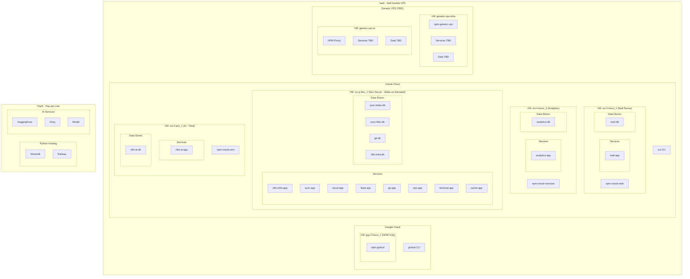

# Cloud Dashboard - Frontend Specification

> **Document Type**: Frontend Design Specification
> **Parent Document**: Cloud-spec_.md (Main Specification)
> **Data Source**: cloud_dash.json (cloud-infrastructure.json)
> **Version**: 3.2.0 | **Updated**: 2025-12-04

## Overview

This document specifies the **frontend structure** of the Cloud Dashboard. It serves as:

1. **Design Blueprint**: Defines the UI layout, views, and components
2. **Mermaid Source of Truth**: Contains authoritative Mermaid diagrams for architecture visualization
3. **Data Mapping**: Specifies which JSON fields populate which UI elements

### Relationship to Other Documents

```
Cloud-spec_.md (Main Spec)
├── Sections 1-14: Infrastructure, Security, Network, API
├── Section 15: Dashboard Architecture (Flask API ↔ JS ↔ HTML)
└── Section 16: Frontend Views (references THIS document)

Cloud-spec_Tables.md (THIS FILE)
├── Page Structure: index.html navigation
├── Services Views: Front/Back, Cards/Lists
├── Architecture Views: Mermaid diagrams
└── Monitoring Views: Status tables and trees

cloud_dash.json
└── Data consumed by both Flask API and frontend JS
```

---


# Index.html
- Services
    - Cards Front
    - Cards Back

- Architeture
    - Resources
    - Server
    - AI

- Monitoring
    - Backlog
    - Status (Tree)
    - Status (List)


---


# Services
## Cards

Front
`3 collumns  User vs Coder vs AI`
    User
    - Sync
    - Mail
    - VPN

    Coder
    - Web IDE (OS_Shell|Flask)
    - Gitlab
    - Analytics

    AI
    - AI WebChat
    - AI CLI


Back
    `2 collumns Root vs Infra`
    Root
    - Cloud Providers (CLI SSH)
        - OCloud-Management
        - Gcloud_Management

    - VMs (SSH)
        - SSH-VM-Oracle_Services_Serv
        - SSH-VM-Oracle_Web_Server_1
        - SSH-VM-Oracle_Flex_ARM_Server
        - SSH-VM-GCloud_microe2Linux_1
        - SSH-VM-Generic_VPS_0_Infra
        - SSH-VM-Generic_VPS_1_AI

    Infra
    - User Services (SSH)
        - sync-app
        - mail-app
        - vpn-app
        - terminal-app
        - git-app
        - analytics-app

    - Data Bases (SSH)
        - sync-index-db
        - sync-files-db
        - sync-obj-db
        - mail-db
        - git-db
        - git-repos
        - analytics-db
        - cloud-db
        - n8n-ai-db
        - n8n-infra-db

    - Infra Services (SSH)
        - n8n-ai-app
        - n8n-infra-app
        - flask-app
        - cache-app

    - Proxies (Web and SSH)
        - npm-oracle-services
        - npm-oracle-web
        - npm-oracle-arm
        - npm-gcloud


---


---


# Architeture

## Resources

    User
    - Sync
    - Mail
    - VPN

    Coder
    - Web IDE (OS_Shell|Flask)
    - Gitlab
    - Analytics

    AI
    - AI WebChat
    - AI CLI


### User and Coder

#### Services

##### User

| Mode | Service | RAM (Avg) | Storage (Avg) | Bandwidth (Avg) | Notes |
|------|---------|-----------|---------------|-----------------|-------|
| on | **sync** | **128-256 MB** | **5.2-106 GB** | **10-50 GB/mo** | Syncthing file sync |
|  | ↳ sync-app | 128-256 MB | 100-500 MB | 10-50 GB/mo | App + config |
|  | ↳ sync-index-db | - | 100-500 MB | - | File metadata index |
|  | ↳ sync-files-db | - | ~100 GB | - | Synced files storage |
|  | ↳ sync-obj-db | - | ~5 GB | - | Object/blob storage |
| dev | **mail** | **520 MB-1 GB** | **5-50 GB** | **1-10 GB/mo** | Email stack |
|  | ↳ mail-app | 512 MB - 1 GB | 100-500 MB | 1-10 GB/mo | App + config |
|  | ↳ mail-db | 8-32 MB | 5-50 GB | - | SQLite - Mailboxes + indexes |
| dev | **vpn** | **64-128 MB** | **50-100 MB** | **5-50 GB/mo** | OpenVPN server |
|  | ↳ vpn-app | 64-128 MB | 50-100 MB | 5-50 GB/mo | Client configs + certs |


##### Coder

| Mode | Service | RAM (Avg) | Storage (Avg) | Bandwidth (Avg) | Notes |
|------|---------|-----------|---------------|-----------------|-------|
| dev | **terminal** | **64-128 MB** | **50-100 MB** | **500 MB-2 GB/mo** | Web terminal |
|  | ↳ terminal-app | 64-128 MB | 50-100 MB | 500 MB-2 GB/mo | wetty/ttyd session-based |
| on | **cloud** | **64-128 MB** | **55-105 MB** | **150-700 MB/mo** | Cloud Dashboard |
|  | ↳ cloud-app | - | ~5 MB | 50-200 MB/mo | Static HTML/CSS/JS |
|  | ↳ flask-app | 64-128 MB | 50-100 MB | 100-500 MB/mo | Flask Web Server |
| dev | **photos** | **150-350 MB** | **200-500 MB** | **100-500 MB/mo** | Photo library management |
|  | ↳ photoview-app | 100-150 MB | 100-200 MB | 50-300 MB/mo | Lightweight photo viewer (Phase 1) |
|  | ↳ photoprism-app | - | - | - | Full-featured viewer (Phase 2) |
|  | ↳ immich-app | - | - | - | Feature-rich viewer no ML (Phase 2) |
|  | ↳ photos-db | 50-200 MB | 100-300 MB | - | PostgreSQL metadata (EXIF, location, AI results) |
|  | ↳ photos-webhook | - | <5 MB | - | Python S3 event processor (triggered only) |
| on | **analytics** | **512 MB-1 GB** | **3-15 GB** | **500 MB-2 GB/mo** | Matomo Analytics platform |
|  | ↳ analytics-app | 256-512 MB | 2-5 GB | 500 MB-2 GB/mo | PHP FPM Alpine |
|  | ↳ analytics-db | 256-512 MB | 1-10 GB | - | MariaDB - grows with data |
| dev | **git** | **264-544 MB** | **11-15 GB** | **2-10 GB/mo** | Gitea hosting |
|  | ↳ git-app | 256-512 MB | 1-5 GB | 2-10 GB/mo | Web + Git server |
|  | ↳ git-db | 8-32 MB | Variable | - | SQLite embedded |
|  | ↳ git-repos | - | ~10 GB | - | Git repositories storage |
| on | **n8n-infra** | **256-512 MB** | **500 MB-2 GB** | **1-5 GB/mo** | Workflow automation |
|  | ↳ n8n-infra-app | 256-512 MB | 500 MB - 2 GB | 1-5 GB/mo | Workflows + execution logs |
| on | **npm** | **512 MB-1 GB** | **400 MB-2 GB** | **20-80 GB/mo** | Reverse proxy (4 instances) |
|  | ↳ npm-oracle-web | 128-256 MB | 100-500 MB | 5-20 GB/mo | Oracle Web Server 1 |
|  | ↳ npm-oracle-services | 128-256 MB | 100-500 MB | 5-20 GB/mo | Oracle Services Server 1 |
|  | ↳ npm-oracle-arm | 128-256 MB | 100-500 MB | 5-20 GB/mo | Oracle ARM (hold) |
|  | ↳ npm-gcloud | 128-256 MB | 100-500 MB | 5-20 GB/mo | GCloud (dev) |
| dev | **cache** | **64-256 MB** | **100 MB-1 GB** | **-** | Redis in-memory store |
|  | ↳ cache-app | 64-256 MB | 100 MB - 1 GB | - | Session/cache data |


Totals

| | | RAM | Storage | Bandwidth | |
|------|---------|-----------|---------------|-----------------|-------|
| | **Total ON** | **~1.4-2.8 GB** | **~9-125 GB** | **~32-135 GB/mo** | Active services |
| | **Total DEV** | **~900 MB-1.8 GB** | **~66-165 GB** | **~8-72 GB/mo** | In development |
| | **Total HOLD** | **~64-256 MB** | **~100 MB-1 GB** | **-** | On hold |
| | **TOTAL Non-AI** | **~2.4-4.9 GB** | **~75-291 GB** | **~40-207 GB/mo** | All Non-AI services |

#### VMs Summary

| Mode | VM | Availability | Services | Total RAM (Est) | Total Storage (Est) | Bandwidth (Est) | Cost |
|--------|-----|--------------|----------|-----------------|---------------------|-----------------|------|
| on | oci-f-micro_1 | 24/7 | mail-app, mail-db, npm-oracle-web | ~650 MB - 1 GB | ~5-50 GB | ~6-30 GB/mo | $0 (Free) |
| on | oci-f-micro_2 | 24/7 | analytics-app, analytics-db, npm-oracle-services | ~640 MB - 1.3 GB | ~4-16 GB | ~6-22 GB/mo | $0 (Free) |
| on | gcp-f-micro_1 | 24/7 | npm-gcloud | ~128-256 MB | ~100-500 MB | ~5-20 GB/mo | $0 (Free) |
| **wake** | **oci-p-flex_1** | **Wake-on-Demand** | n8n-infra-app, sync-app, cloud-app, flask-app, photoview-app, photos-db, photoprism-app*, immich-app*, git-app, vpn-app, terminal-app, cache-app | ~1.5-3.2 GB | ~20-200 GB | ~20-100 GB/mo | **$5.50/mo** |
| hold | oci-f-arm_1 | Hold | n8n-ai-app, n8n-ai-db, npm-oracle-arm | ~1.4-48.5 GB | ~3-20 GB | ~5-20 GB/mo | $0 (Free) |
| tbd | generic-vps | TBD | Variable services | ~1-4 GB | ~20-100 GB | ~10-50 GB/mo | TBD |
|--------|---------|--------------|----------|-----------|---------------|-----------------|------|
| | **Total 24/7 (FREE)** | | | **~1.4-2.5 GB** | **~9-66 GB** | **~17-72 GB/mo** | **$0/mo** |
| | **Total Wake-on-Demand** | | | **~1.2-2.5 GB** | **~17-130 GB** | **~15-70 GB/mo** | **$5.50/mo** |
| | **TOTAL Non-AI** | | | **~2.6-5 GB** | **~26-196 GB** | **~32-142 GB/mo** | **$5.50/mo** |

> **Cost Strategy**: Heavy services (n8n, Syncthing, Gitea, etc.) run on the paid Oracle Dev Server which stays **dormant by default**. Wake it on-demand when needed, keeping monthly costs at ~$5.50 instead of ~$50+.

---

#### VM Allocation Details (Service Breakdown)

##### oci-f-micro_1 (Oracle Free Micro 1) - 24/7 FREE
**Capacity:** 1 GB RAM | 47 GB Storage | IP: 130.110.251.193

| Service | RAM | Storage | Bandwidth | Status |
|---------|-----|---------|-----------|--------|
| mail-app | 512 MB - 1 GB | 100-500 MB | 1-10 GB/mo | dev |
| mail-db | 8-32 MB | 5-50 GB | - | dev |
| npm-oracle-web | 128-256 MB | 100-500 MB | 5-20 GB/mo | on |
| **TOTAL** | **~650 MB - 1.3 GB** | **~5-51 GB** | **~6-30 GB/mo** | |
| **Capacity Check** | **65-130%** | **11-108%** | - | **AT LIMIT** |

> **Note:** Mail uses most RAM. When mail is ON, this VM will be at capacity. Consider disabling npm-oracle-web if needed.

---

##### oci-f-micro_2 (Oracle Free Micro 2) - 24/7 FREE
**Capacity:** 1 GB RAM | 47 GB Storage | IP: 129.151.228.66

| Service | RAM | Storage | Bandwidth | Status |
|---------|-----|---------|-----------|--------|
| analytics-app | 256-512 MB | 2-5 GB | 500 MB-2 GB/mo | on |
| analytics-db | 256-512 MB | 1-10 GB | - | on |
| npm-oracle-services | 128-256 MB | 100-500 MB | 5-20 GB/mo | on |
| **TOTAL** | **~640 MB - 1.3 GB** | **~3-16 GB** | **~6-22 GB/mo** | |
| **Capacity Check** | **64-130%** | **6-34%** | - | **AT LIMIT** |

> **Note:** Analytics uses significant RAM. VM is at capacity.

---

##### gcp-f-micro_1 (GCloud Free Micro 1) - 24/7 FREE
**Capacity:** 1 GB RAM | 30 GB Storage | IP: 34.55.55.234

| Service | RAM | Storage | Bandwidth | Status |
|---------|-----|---------|-----------|--------|
| npm-gcloud | 128-256 MB | 100-500 MB | 5-20 GB/mo | on |
| **TOTAL** | **~128-256 MB** | **~100-500 MB** | **~5-20 GB/mo** | |
| **Capacity Check** | **13-26%** | **0.3-1.7%** | - | **UNDERUTILIZED** |

> **Note:** Only running NPM proxy. Has ~750 MB RAM available for future services.

---

##### oci-p-flex_1 (Oracle Paid Flex 1) - Wake-on-Demand PAID
**Capacity:** 8 GB RAM | 100 GB Storage | IP: 84.235.234.87 | Cost: ~$5.50/mo

| Service | RAM | Storage | Bandwidth | Status |
|---------|-----|---------|-----------|--------|
| n8n-infra-app | 256-512 MB | 500 MB-2 GB | 1-5 GB/mo | on |
| sync-app | 128-256 MB | 100-500 MB | 10-50 GB/mo | on |
| sync-index-db | - | 100-500 MB | - | on |
| sync-files-db | - | ~100 GB | - | on |
| sync-obj-db | - | ~5 GB | - | on |
| cloud-app | - | ~5 MB | 50-200 MB/mo | on |
| flask-app | 64-128 MB | 50-100 MB | 100-500 MB/mo | dev |
| git-app | 256-512 MB | 1-5 GB | 2-10 GB/mo | dev |
| git-db | 8-32 MB | variable | - | dev |
| git-repos | - | ~10 GB | - | dev |
| vpn-app | 64-128 MB | 50-100 MB | 5-50 GB/mo | dev |
| terminal-app | 64-128 MB | 50-100 MB | 500 MB-2 GB/mo | dev |
| cache-app | 64-256 MB | 100 MB-1 GB | - | dev |
| **TOTAL** | **~900 MB - 2 GB** | **~117-125 GB** | **~19-118 GB/mo** | |
| **Capacity Check** | **11-25%** | **117-125%** | - | **STORAGE LIMIT** |

> **Warning:** Storage exceeds 100 GB capacity due to sync-files-db (~100 GB). Consider external storage or reducing synced files.

---

##### oci-f-arm_1 (Oracle Free ARM 1) - HOLD
**Capacity:** 24 GB RAM | 200 GB Storage | IP: pending

| Service | RAM | Storage | Bandwidth | Status |
|---------|-----|---------|-----------|--------|
| n8n-ai-app | 1-48 GB | 2-10 GB | 5-20 GB/mo | hold |
| n8n-ai-db | 256-512 MB | 1-10 GB | - | hold |
| npm-oracle-arm | 128-256 MB | 100-500 MB | 5-20 GB/mo | hold |
| **TOTAL** | **~1.4-48.8 GB** | **~3-21 GB** | **~10-40 GB/mo** | |
| **Capacity Check** | **6-203%** | **2-11%** | - | **RAM VARIABLE** |

> **Note:** AI workloads can use 1-48 GB RAM depending on LLM context. Monitor usage.


### AI
#### Services

| Mode | Service | Category | RAM (Avg) | Storage (Avg) | Bandwidth (Avg) | Notes |
|--------|---------|----------|-----------|---------------|-----------------|-------|
| hold | **n8n-ai** | ML | **1.3-48 GB** | **3-20 GB** | **5-20 GB/mo** | AI Agentic workflows |
|  | ↳ n8n-ai-app | | 1-48 GB | 2-10 GB | 5-20 GB/mo | LLM context + workflows |
|  | ↳ n8n-ai-db | | 256-512 MB | 1-10 GB | - | PostgreSQL - varies by usage |
|--------|---------|----------|-----------|---------------|-----------------|-------|
| | **Total HOLD** | | **~1.3-48.5 GB** | **~3-20 GB** | **~5-20 GB/mo** | On hold (ARM 6-24GB avail) |
| | **TOTAL AI** | | **~1.3-48.5 GB** | **~3-20 GB** | **~5-20 GB/mo** | All AI services |


#### VMs

| Mode | VM | Services | Total RAM (Est) | Total Storage (Est) | Bandwidth (Est) |
|--------|-----|----------|-----------------|---------------------|-----------------|
| hold | Oracle ARM Server | n8n-ai-app, n8n-ai-db, npm-oracle-arm | ~6-24 GB | ~5-20 GB | ~10-40 GB/mo |
| tbd | Generic VPS (AI) | LLM inference, AI workloads | ~8-32 GB | ~50-200 GB | ~20-100 GB/mo |
|--------|---------|----------|-----------|---------------|-----------------|
| | **Total HOLD** | | **~6-24 GB** | **~5-20 GB** | **~10-40 GB/mo** |
| | **Total TBD** | | **~8-32 GB** | **~50-200 GB** | **~20-100 GB/mo** |
| | **TOTAL AI** | | **~14-56 GB** | **~55-220 GB** | **~30-140 GB/mo** |


## Servers

`use the .html that already exists, dont lose it!! arch.html`

`(add here mermaid code of the architeture design)`

## AI
 `   (add here mermaid code of ach design) `
`use the .html that already exists, dont lose it!! ai-arch.html`


---


# Monitoring
## Status (list)

`Cloud_Dashboard.py from flask`

`htop to retrieve RAM Usage`

In Web:
`IP:port click to copy`
`| URL| buttom to clikc and open in a new window `
`SSH made a buttom to just copy the data`

In the Srcipt:
`IP:port keep visible`
`| URL| keep visible `
`SSH keep visible`

##### User Services

| Mode | Service | IP:port | URL | SSH | RAM | Storage | Status |
|------|---------|---------|-----|-----|-----|---------|--------|
| on | **sync-app** | 84.235.234.87:8384 | sync.diegonmarcos.com | ssh ubuntu@84.235.234.87 | 128-256 MB | 5-106 GB | on |
| dev | **mail-app** | 130.110.251.193:25,587,993 | mail.diegonmarcos.com | ssh ubuntu@130.110.251.193 | 520 MB-1 GB | 5-50 GB | dev |
| dev | **vpn-app** | 84.235.234.87:1194 | - | ssh ubuntu@84.235.234.87 | 64-128 MB | 50-100 MB | dev |

##### Coder Services

| Mode | Service | IP:port | URL | SSH | RAM | Storage | Status |
|------|---------|---------|-----|-----|-----|---------|--------|
| dev | **terminal-app** | 84.235.234.87:7681 | terminal.diegonmarcos.com | ssh ubuntu@84.235.234.87 | 64-128 MB | 50-100 MB | dev |
| dev | **git-app** | 84.235.234.87:3000 | git.diegonmarcos.com | ssh ubuntu@84.235.234.87 | 264-544 MB | 11-15 GB | dev |
| on | **analytics-app** | 129.151.228.66:8080 | analytics.diegonmarcos.com | ssh ubuntu@129.151.228.66 | 512 MB-1 GB | 3-15 GB | on |
| on | **cloud-app** | 84.235.234.87:80 | cloud.diegonmarcos.com | ssh ubuntu@84.235.234.87 | - | ~5 MB | on |

##### Infra Services

| Mode | Service | IP:port | URL | SSH | RAM | Storage | Status |
|------|---------|---------|-----|-----|-----|---------|--------|
| on | **n8n-infra-app** | 84.235.234.87:5678 | n8n.diegonmarcos.com | ssh ubuntu@84.235.234.87 | 256-512 MB | 500 MB-2 GB | on |
| hold | **n8n-ai-app** | [pending]:5678 | ai.diegonmarcos.com | ssh ubuntu@[ARM IP] | 1-48 GB | 3-20 GB | hold |
| dev | **flask-app** | 84.235.234.87:5000 | flask.diegonmarcos.com | ssh ubuntu@84.235.234.87 | 64-128 MB | 50-100 MB | dev |
| dev | **cache-app** | 84.235.234.87:6379 | - | ssh ubuntu@84.235.234.87 | 64-256 MB | 100 MB-1 GB | dev |

##### Proxies (NPM)

| Mode | Service | IP:port | URL | SSH | RAM | Storage | Status |
|------|---------|---------|-----|-----|-----|---------|--------|
| on | **npm-oracle-services** | 129.151.228.66:81 | - | ssh ubuntu@129.151.228.66 | 128-256 MB | 100-500 MB | on |
| on | **npm-oracle-web** | 130.110.251.193:81 | - | ssh ubuntu@130.110.251.193 | 128-256 MB | 100-500 MB | on |
| hold | **npm-oracle-arm** | [pending]:81 | - | ssh ubuntu@[ARM IP] | 128-256 MB | 100-500 MB | hold |
| on | **npm-gcloud** | 34.55.55.234:81 | - | gcloud compute ssh arch-1 --zone us-central1-a | 128-256 MB | 100-500 MB | on |
| tbd | **npm-generic-vps** | [pending]:81 | - | - | 128-256 MB | 100-500 MB | tbd |

##### VMs

| Mode | VM | IP | SSH | Services | RAM | Storage | Status |
|------|----|----|-----|----------|-----|---------|--------|
| on | oci-f-micro_1 | 130.110.251.193 | ssh ubuntu@130.110.251.193 | mail-app, mail-db, npm-oracle-web | 650 MB-1.3 GB | 5-51 GB | on |
| on | oci-f-micro_2 | 129.151.228.66 | ssh ubuntu@129.151.228.66 | analytics-app, analytics-db, npm-oracle-services | 640 MB-1.3 GB | 3-16 GB | on |
| on | gcp-f-micro_1 | 34.55.55.234 | gcloud compute ssh arch-1 --zone us-central1-a | npm-gcloud | 128-256 MB | 100-500 MB | on |
| wake | oci-p-flex_1 | 84.235.234.87 | ssh ubuntu@84.235.234.87 | n8n-infra-app, sync-app, cloud-app, flask-app, git-app, vpn-app, terminal-app, cache-app | 900 MB-2 GB | 17-130 GB | wake |
| hold | oci-f-arm_1 | [pending] | ssh ubuntu@[ARM IP] | n8n-ai-app, n8n-ai-db, npm-oracle-arm | 1.4-48.8 GB | 3-21 GB | hold |
| tbd | generic-vps-infra | [pending] | - | TBD | 1-4 GB | 20-100 GB | tbd |
| tbd | generic-vps-ai | [pending] | - | TBD | 8-32 GB | 50-200 GB | tbd |


## Status (Tree)

`in tree view only show one card under each and if is healthy or off plus the name of it and a buttom to copy ssh command and/or link to url admin`

### Mermaid Baseline (Source of Truth)



### Tree Structure (derived from Mermaid)

```
Cloud Infrastructure
├── IaaS (Self-Hosted VPS)
│   │
│   ├── Google Cloud
│   │   ├── [CLI] gcloud
│   │   └── VM: gcp-f-micro_1 [on] (NPM Only)
│   │       └── npm-gcloud [on]
│   │
│   ├── Oracle Cloud
│   │   ├── [CLI] oci
│   │   │
│   │   ├── VM: oci-f-micro_1 [on] (Mail Server)
│   │   │   ├── npm-oracle-web [on]
│   │   │   ├── Services
│   │   │   │   └── mail-app [dev]
│   │   │   └── Data
│   │   │       └── mail-db [dev]
│   │   │
│   │   ├── VM: oci-f-micro_2 [on] (Analytics)
│   │   │   ├── npm-oracle-services [on]
│   │   │   ├── Services
│   │   │   │   └── analytics-app [on]
│   │   │   └── Data
│   │   │       └── analytics-db [on]
│   │   │
│   │   ├── VM: oci-p-flex_1 [wake] (Dev Server - Wake-on-Demand)
│   │   │   ├── Services
│   │   │   │   ├── n8n-infra-app [on]
│   │   │   │   ├── sync-app [on]
│   │   │   │   ├── cloud-app [on]
│   │   │   │   ├── flask-app [dev]
│   │   │   │   ├── git-app [dev]
│   │   │   │   ├── vpn-app [dev]
│   │   │   │   ├── terminal-app [dev]
│   │   │   │   └── cache-app [dev]
│   │   │   └── Data
│   │   │       ├── sync-index-db [on]
│   │   │       ├── sync-files-db [on]
│   │   │       ├── git-db [dev]
│   │   │       └── n8n-infra-db [on]
│   │   │
│   │   └── VM: oci-f-arm_1 [hold] (AI Server)
│   │       ├── npm-oracle-arm [hold]
│   │       ├── Services
│   │       │   └── n8n-ai-app [hold]
│   │       └── Data
│   │           └── n8n-ai-db [hold]
│   │
│   └── Generic VPS (TBD)
│       ├── VM: generic-vps-infra [tbd]
│       │   ├── npm-generic-vps
│       │   ├── Services (TBD)
│       │   └── Data (TBD)
│       └── VM: generic-vps-ai [tbd]
│           ├── NPM Proxy
│           ├── Services (TBD)
│           └── Data (TBD)
│
└── PaaS (Pay-per-Use)
    ├── Python Hosting
    │   ├── Streamlit
    │   └── Railway/Render
    └── AI Services
        ├── HuggingFace Spaces/API
        ├── Groq
        ├── Modal/RunPod
        └── Together AI/OpenRouter
```


## Backlog


---


# Architecture Reference Tables

## Service Registry (Master List)

| Service ID | Display Name | Category | VM | Docker Network | Availability | Status |
|------------|--------------|----------|-----|----------------|--------------|--------|
| **24/7 Services (FREE TIER)** |
| mail-app | Mail Server | user | oci-f-micro_1 | mail_network | 24/7 | dev |
| mail-db | Mail Database | user | oci-f-micro_1 | mail_network | 24/7 | dev |
| npm-oracle-web | NPM (Oracle Web) | infra-proxy | oci-f-micro_1 | mail_network | 24/7 | on |
| analytics-app | Matomo Analytics | coder | oci-f-micro_2 | matomo_network | 24/7 | on |
| analytics-db | Matomo DB | coder | oci-f-micro_2 | matomo_network | 24/7 | on |
| npm-oracle-services | NPM (Oracle Services) | infra-proxy | oci-f-micro_2 | matomo_network | 24/7 | on |
| npm-gcloud | NPM (GCloud) | infra-proxy | gcp-f-micro_1 | proxy_network | 24/7 | on |
| **Wake-on-Demand Services (PAID - oci-p-flex_1)** |
| n8n-infra-app | n8n (Infra) | infra-services | oci-p-flex_1 | dev_network | Wake | on |
| sync-app | Syncthing | user | oci-p-flex_1 | dev_network | Wake | on |
| cloud-app | Cloud Dashboard | coder | oci-p-flex_1 | dev_network | Wake | on |
| flask-app | Flask Web Server | infra-services | oci-p-flex_1 | dev_network | Wake | dev |
| git-app | Gitea | coder | oci-p-flex_1 | dev_network | Wake | dev |
| vpn-app | OpenVPN | user | oci-p-flex_1 | dev_network | Wake | dev |
| terminal-app | Web Terminal | coder | oci-p-flex_1 | dev_network | Wake | dev |
| cache-app | Redis Cache | infra-services | oci-p-flex_1 | dev_network | Wake | dev |
| **Hold Services (ARM - future)** |
| n8n-ai-app | n8n (AI) | ai | oci-f-arm_1 | ai_network | Hold | hold |
| npm-oracle-arm | NPM (Oracle ARM) | infra-proxy | oci-f-arm_1 | ai_network | Hold | hold |

> **Note**: Services on `oci-p-flex_1` are only available when the VM is running. Check status and wake if needed.

## Database Registry

| DB ID | Display Name | Technology | RAM (Independent) | Storage (Typical) | Parent Service | VM | Status |
|-------|--------------|------------|-------------------|-------------------|----------------|-----|--------|
| mail-db | Mail DB | SQLite | 8-32 MB | 5-50 GB | mail-app | oci-f-micro_1 | dev |
| analytics-db | Matomo DB | MariaDB 11.4 | 256-512 MB | 1-10 GB | analytics-app | oci-f-micro_2 | on |
| sync-index-db | Sync Index DB | LevelDB (embedded) | Negligible (<5 MB) | 100-500 MB | sync-app | oci-p-flex_1 | on |
| sync-files-db | Sync Files | File Storage | None (No RAM) | ~100 GB | sync-app | oci-p-flex_1 | on |
| sync-obj-db | Sync Objects | Blob Storage | None (No RAM) | ~5 GB | sync-app | oci-p-flex_1 | on |
| git-db | Gitea DB | SQLite | 8-32 MB | Variable | git-app | oci-p-flex_1 | dev |
| git-repos | Git Repositories | File Storage | None (No RAM) | ~10 GB | git-app | oci-p-flex_1 | dev |
| n8n-infra-db | n8n Infra DB | SQLite | 64-128 MB | 500 MB - 2 GB | n8n-infra-app | oci-p-flex_1 | on |
| n8n-ai-db | n8n AI DB | PostgreSQL | 256-512 MB | 1-10 GB | n8n-ai-app | oci-f-arm_1 | hold |
| cloud-db | Cloud Dashboard DB | SQLite/PostgreSQL | 8-32 MB | 50-200 MB | cloud-app | oci-p-flex_1 | dev |
| cache-app | Redis Cache | Redis (In-Memory) | 64-256 MB | 100 MB - 1 GB | System-wide | oci-p-flex_1 | dev |

## VM Specifications

| VM ID | Provider | Instance Type | CPU | RAM | Storage | OS | Availability | Cost | Status |
|-------|----------|---------------|-----|-----|---------|-----|--------------|------|--------|
| oci-f-micro_1 | Oracle | VM.Standard.E2.1.Micro | 1 OCPU (AMD) | 1 GB | 47 GB | Ubuntu 24.04 | 24/7 | $0 (Free) | on |
| oci-f-micro_2 | Oracle | VM.Standard.E2.1.Micro | 1 OCPU (AMD) | 1 GB | 47 GB | Ubuntu 24.04 | 24/7 | $0 (Free) | on |
| gcp-f-micro_1 | GCloud | e2-micro | 0.25-2 vCPU | 1 GB | 30 GB | Arch Linux | 24/7 | $0 (Free) | on |
| **oci-p-flex_1** | Oracle | VM.Standard.E4.Flex | 1 OCPU (2 vCPU) | 8 GB | 100 GB | Ubuntu 22.04 | **Wake-on-Demand** | **$5.50/mo** | wake |
| oci-f-arm_1 | Oracle | VM.Standard.A1.Flex | 4 OCPU (ARM64) | 24 GB | 200 GB | Ubuntu 24.04 | On-Hold | $0 (Free) | hold |
| generic-vps-infra | TBD | TBD | TBD | 1-4 GB | 20-100 GB | TBD | TBD | TBD | tbd |
| generic-vps-ai | TBD | TBD | TBD | 8-32 GB | 50-200 GB | TBD | TBD | TBD | tbd |

> **Wake-on-Demand**: The `oci-p-flex_1` is a PAID VM that should be **STOPPED by default**. Use the wake API endpoint or OCI CLI to start it when needed. Stop it when done to minimize costs.

## Network Configuration

### Public IPs

| VM | Public IP | Private IP | SSH Command | Availability |
|----|-----------|------------|-------------|--------------|
| oci-f-micro_1 | 130.110.251.193 | 10.0.0.x | `ssh ubuntu@130.110.251.193` | 24/7 |
| oci-f-micro_2 | 129.151.228.66 | 10.0.0.x | `ssh ubuntu@129.151.228.66` | 24/7 |
| gcp-f-micro_1 | 34.55.55.234 | 10.128.0.x | `gcloud compute ssh arch-1 --zone us-central1-a` | 24/7 |
| **oci-p-flex_1** | 84.235.234.87 | 10.0.0.x | `ssh ubuntu@84.235.234.87` | **Wake-on-Demand** |
| oci-f-arm_1 | [pending] | [pending] | `ssh ubuntu@[ARM IP]` | Hold |

### Docker Networks per VM

| VM | Network Name | Subnet | Purpose |
|----|--------------|--------|---------|
| oci-f-micro_1 | mail_network | 172.20.0.0/24 | Mail services (mail-app, mail-db) |
| oci-f-micro_2 | matomo_network | 172.21.0.0/24 | Analytics stack |
| gcp-f-micro_1 | proxy_network | 172.23.0.0/24 | NPM proxy only |
| **oci-p-flex_1** | dev_network | 172.24.0.0/24 | Dev services (n8n, sync, git, cloud, vpn, cache) |
| oci-f-arm_1 | ai_network | 172.22.0.0/24 | AI services (future) |

### Firewall Rules Summary

| VM | External Ports | Internal Ports | Availability |
|----|----------------|----------------|--------------|
| oci-f-micro_1 | 22, 80, 443, 25, 587, 993 | - | 24/7 |
| oci-f-micro_2 | 22, 80, 443, 81 | 8080, 3306 | 24/7 |
| gcp-f-micro_1 | 22, 80, 443, 81 | - | 24/7 |
| **oci-p-flex_1** | 22, 80, 443, 22000, 21027, 1194, 2222 | 5678, 8384, 5000, 3000, 7681, 6379 | Wake-on-Demand |
| oci-f-arm_1 | 22, 80, 443, 81 | 5678 | Hold |

## Domain Routing

| Domain | Service | VM | IP | SSL | Availability | Status |
|--------|---------|-----|-----|-----|--------------|--------|
| **24/7 Services (FREE)** |
| analytics.diegonmarcos.com | analytics-app | oci-f-micro_2 | 129.151.228.66 | ✓ | 24/7 | on |
| mail.diegonmarcos.com | mail-app | oci-f-micro_1 | 130.110.251.193 | ✓ | 24/7 | dev |
| **Wake-on-Demand Services (PAID)** |
| sync.diegonmarcos.com | sync-app | oci-p-flex_1 | 84.235.234.87 | ✓ | Wake | on |
| n8n.diegonmarcos.com | n8n-infra-app | oci-p-flex_1 | 84.235.234.87 | ✓ | Wake | on |
| cloud.diegonmarcos.com | cloud-app | oci-p-flex_1 | 84.235.234.87 | ✓ | Wake | on |
| git.diegonmarcos.com | git-app | oci-p-flex_1 | 84.235.234.87 | ✓ | Wake | dev |
| **Hold Services** |
| ai.diegonmarcos.com | n8n-ai-app | oci-f-arm_1 | [pending] | ✓ | Hold | hold |

## Port Mapping Reference

| Service | Internal Port | External Port | Protocol | Notes |
|---------|---------------|---------------|----------|-------|
| npm-* | 81 | 81 | TCP | Admin UI |
| npm-* | 80 | 80 | TCP | HTTP redirect |
| npm-* | 443 | 443 | TCP | HTTPS termination |
| n8n-infra-app | 5678 | 443 (via NPM) | HTTPS | Workflow UI |
| n8n-ai-app | 5678 | 443 (via NPM) | HTTPS | AI Workflow UI |
| sync-app | 8384 | 443 (via NPM) | HTTPS | Sync GUI |
| sync-app | 22000 | 22000 | TCP | Sync protocol |
| sync-app | 21027 | 21027 | UDP | Discovery |
| analytics-app | 8080 | 443 (via NPM) | HTTPS | Analytics UI |
| git-app | 3000 | 443 (via NPM) | HTTPS | Git Web UI |
| git-app | 2222 | 2222 | TCP | Git SSH |
| vpn-app | 1194 | 1194 | UDP | VPN tunnel |
| mail-app | 25 | 25 | TCP | SMTP |
| mail-app | 587 | 587 | TCP | Submission |
| mail-app | 993 | 993 | TCP | IMAPS |
| cache-app | 6379 | - | TCP | Internal only |
| flask-app | 5000 | - | TCP | Internal only |

## Docker Images

| Service | Image | Version |
|---------|-------|---------|
| analytics-app | matomo:fpm-alpine | latest |
| analytics-db | mariadb | 11.4 |
| sync-app | syncthing/syncthing | latest |
| n8n-infra-app | n8nio/n8n | latest |
| n8n-ai-app | n8nio/n8n | latest |
| git-app | gitea/gitea | latest |
| mail-app | docker-mailserver/docker-mailserver | latest |
| vpn-app | kylemanna/openvpn | latest |
| cache-app | redis | alpine |
| npm-* | jc21/nginx-proxy-manager | latest |

## Cloud Provider Summary

| Provider | Tier | Region | Console URL | CLI |
|----------|------|--------|-------------|-----|
| Oracle Cloud | Always Free | eu-marseille-1 | cloud.oracle.com | `oci` |
| Google Cloud | Free Tier | us-central1 | console.cloud.google.com | `gcloud` |

## Service Categories

| Category ID | Name | Description | Services |
|-------------|------|-------------|----------|
| user | User Services | End-user productivity | sync-app, mail-app, vpn-app |
| coder | Coder Services | Developer tools | terminal-app, cloud-app, analytics-app, git-app |
| ai | AI Services | AI and automation | n8n-ai-app |
| infra-proxy | Proxies | Nginx Proxy Managers | npm-oracle-web, npm-oracle-services, npm-oracle-arm, npm-gcloud |
| infra-db | Databases | Database services | All *-db services |
| infra-services | Infra Services | Infrastructure automation | n8n-infra-app, flask-app, cache-app |

## Status Legend

| Status | Description | Color |
|--------|-------------|-------|
| on | Running and accessible | Green |
| dev | Under active development | Blue |
| wake | Wake-on-Demand (dormant by default, started when needed) | Cyan |
| hold | Waiting for resources (VM pending) | Yellow |
| tbd | Planned for future | Gray |

## Quick Commands Reference

### SSH Access
```bash
# Oracle Web Server 1 (24/7 FREE)
ssh ubuntu@130.110.251.193

# Oracle Services Server 1 (24/7 FREE)
ssh ubuntu@129.151.228.66

# GCloud Arch 1 (24/7 FREE)
gcloud compute ssh arch-1 --zone us-central1-a

# Oracle Dev Server (Wake-on-Demand PAID)
ssh ubuntu@84.235.234.87
```

### Docker Commands
```bash
# List running containers
sudo docker ps --format 'table {{.Names}}\t{{.Status}}\t{{.Ports}}'

# View container logs
sudo docker logs --tail 100 <container>

# Enter container shell
sudo docker exec -it <container> bash

# Container stats
docker stats --no-stream
```

### System Monitoring
```bash
# Disk usage
df -h

# Memory usage
free -h

# CPU usage
htop
```


---

