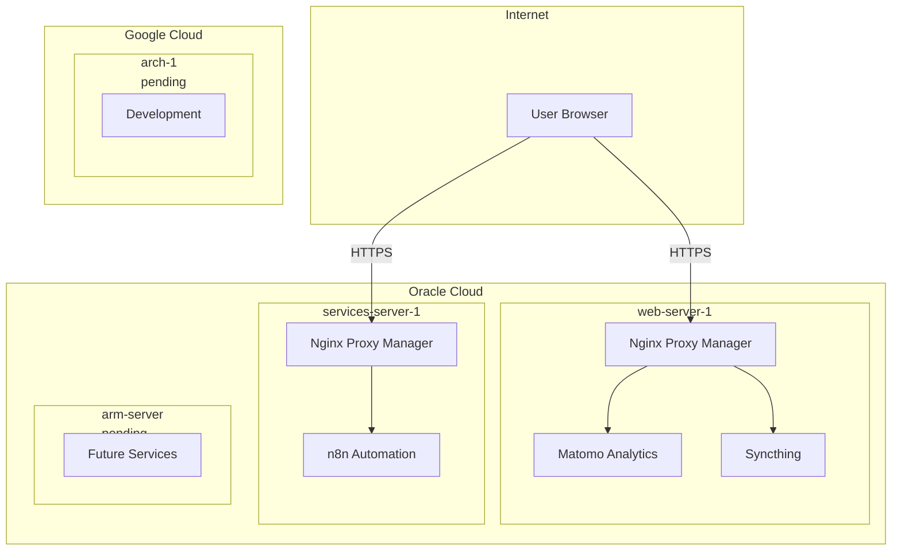
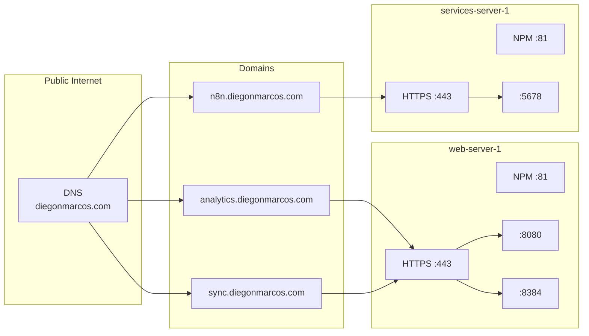
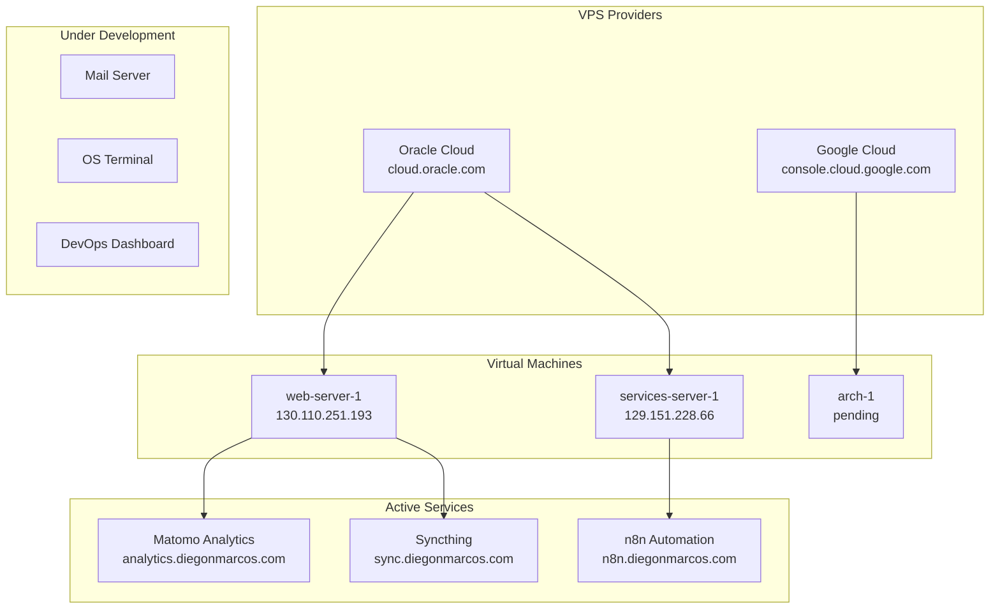
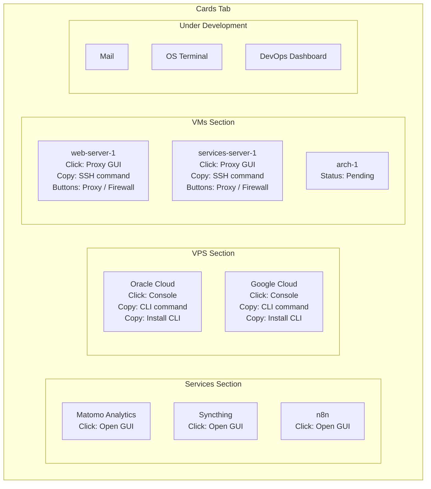
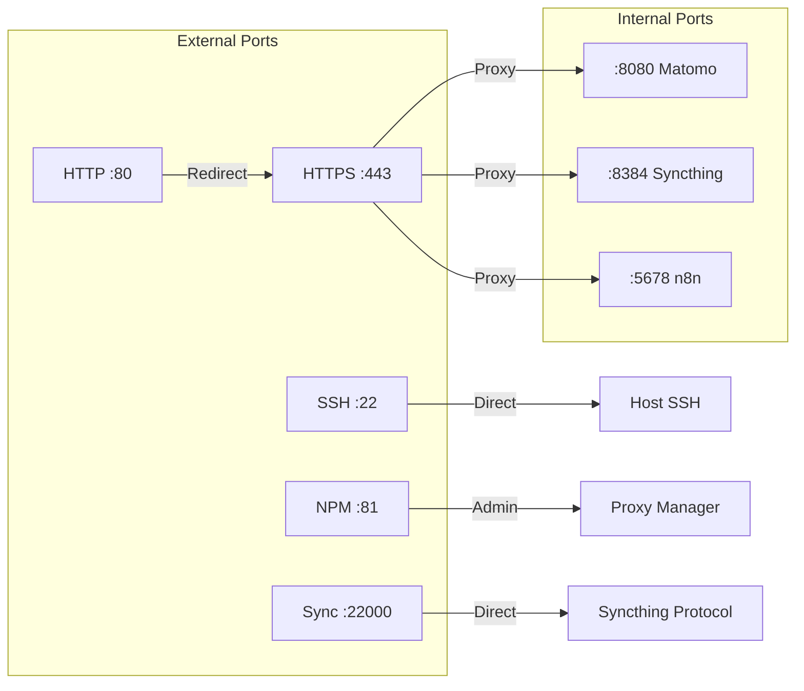

# Cloud Infrastructure Handoff

> **For Web Designer**: This document provides the visual structure and relationships.
> **For Data**: See the CSV files for IPs, ports, commands, and service details.

---

## Quick Reference

| File | Purpose | Update By |
|------|---------|-----------|
| `infrastructure.csv` | VMs: IPs, regions, status | Cloud Engineer |
| `services.csv` | Services: ports, domains, categories | Cloud Engineer |
| `ports.csv` | Firewall rules, port mappings | Cloud Engineer |
| `commands.csv` | SSH, CLI commands | Cloud Engineer |
| `HANDOFF.md` | Architecture diagrams | Cloud Engineer |

---

## 1. High-Level Architecture

---

## 2. Network Topology

---

## 3. Service Categories

---

## 4. Dashboard Card Structure

---

## 5. Port Flow Diagram

---

## 6. Access Methods

| Access Type | Method | Example |
|-------------|--------|---------|
| Service GUI | HTTPS via domain | `https://analytics.diegonmarcos.com` |
| Proxy Admin | HTTP via IP:81 | `http://130.110.251.193:81` |
| SSH Access | SSH via IP:22 | `ssh -i ~/.ssh/key ubuntu@IP` |
| Firewall | Cloud Console | Oracle Security Lists |
| CLI | Terminal command | `oci compute instance list` |

---

## Changelog

| Date | Change | By |
|------|--------|-----|
| 2025-11-27 | Initial handoff structure | Cloud Engineer |

