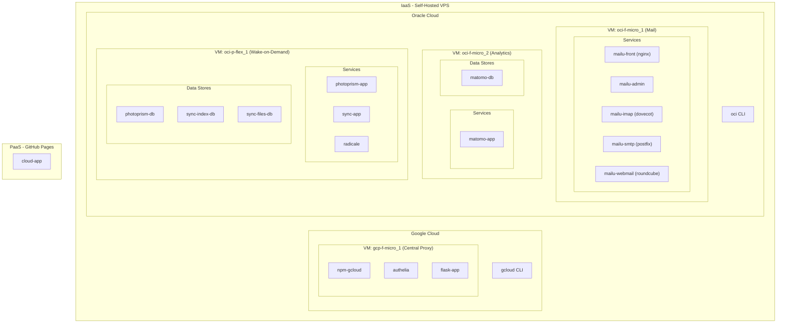

# Cloud Dashboard - Frontend Specification

> **Document Type**: Frontend Design Specification
> **Parent Document**: Cloud-spec_.md (Main Specification)
> **Data Source**: cloud_dash.json (cloud-infrastructure.json)
> **Version**: 3.4.0 | **Updated**: 2025-12-14

## Overview

This document specifies the **frontend structure** of the Cloud Dashboard. It serves as:

1. **Design Blueprint**: Defines the UI layout, views, and components
2. **Mermaid Source of Truth**: Contains authoritative Mermaid diagrams for architecture visualization
3. **Data Mapping**: Specifies which JSON fields populate which UI elements

### Relationship to Other Documents

```
back-System/cloud/
│
├── 0.spec/                             ← Research & task tracking
│
├── 1.ops/                              ← Operations & Orchestration
│   ├── Cloud-spec_.md                  ← Main specification
│   ├── Cloud-spec_Tables.md            ← THIS FILE (Frontend spec)
│   └── cloud_dash.json                 ← Primary data source
│
├── a_solutions/                        ← Applications (by solution)
│   ├── api/                            ← Cloud API & Dashboard Backend
│   │   ├── src/                        ← Source files (cloud_dash.py, etc.)
│   │   └── flask-app/                  ← Flask API server
│   ├── analytics/                      ← Matomo Analytics
│   ├── mail/                           ← Mailu Mail Server
│   ├── photos/                         ← Photoprism
│   ├── sync/                           ← Syncthing
│   └── ...                             ← Other solutions
│
└── b_infra/                            ← Infrastructure (by VM)
    ├── gcp-f-micro_1/                  ← GCloud VM (NPM + Authelia)
    ├── oci-f-micro_1/                  ← Oracle VM (Mail)
    ├── oci-f-micro_2/                  ← Oracle VM (Analytics)
    ├── oci-p-flex_1/                   ← Oracle VM (Dev Server)
    └── local_SurfacePro8/              ← Local machine
```

**Document Hierarchy:**
| Document | Location | Purpose |
|----------|----------|---------|
| Cloud-spec_.md | `1.ops/` | Main specification (architecture, security, network) |
| Cloud-spec_Tables.md | `1.ops/` | Frontend spec (views, diagrams, UI mapping) |
| cloud_dash.json | `1.ops/` | Primary data source for Flask API and frontend JS |

---


# Index.html
- Services
    - Cards Front
    - Cards Back

- Architeture
    - Resources
    - Server
    - AI

- Monitoring
    - Backlog
    - Status (Tree)
    - Status (List)


---


# Services
## Cards (Users view vs Devs View)

- Users
    - AI
        - AI CLI app
        - AI Web Chat

    - User
        - Productivity
            - Photos
            - Mail
            - Drive
            - Dashboard
        - Security
            - Vault
            - VPN+DNS (Encrypted)
            -

    - Coder
        - SSH
            - SSH App (application with TUI and with list of all SSH addesess and important commands)
            - SSH Web (Terminal (SSH App in Web)
        - WEB
            - VNC GUI (GUI for the VMS that have a GUI)
            - VScode with VPN to the servers
        - Dash
            - Cloud Dashboard Web (Services, Architeture Plan, Monitoring... works trogh API)
            - Cloud Dash App (the html+phyton that generates the json.js files and have the teh full json with it)


- Devs
    Root
    - Cloud Providers (CLI SSH)
        - OCloud-Management
        - Gcloud_Management

    - VMs (SSH)
        - SSH-VM-Oracle_Services_Serv
        - SSH-VM-Oracle_Web_Server_1
        - SSH-VM-Oracle_Flex_ARM_Server
        - SSH-VM-GCloud_microe2Linux_1
        - SSH-VM-Generic_VPS_0_Infra
        - SSH-VM-Generic_VPS_1_AI

    Infra
    - User Services (SSH)
        - sync-app
        - mail-app
        - vpn-app
        - terminal-app
        - git-app
        - matomo-app

    - Data Bases (SSH)
        - sync-index-db
        - sync-files-db
        - sync-obj-db
        - mail-db
        - git-db
        - git-repos
        - matomo-db
        - cloud-db

    - Infra Services (SSH)
        - flask-app
        - cache-app

    - Proxies (Web and SSH)
        - npm-gcloud-app
        - O2auth-app
        - Authelia-app


---


---


# Architeture

## Resources

    User
    - Sync
    - Mail
    - VPN

    Coder
    - Web IDE (OS_Shell|Flask)
    - Gitlab
    - Analytics

    AI
    - AI WebChat
    - AI CLI


### User and Coder

#### Services

##### User

| Mode | Service | RAM (Avg) | Storage (Avg) | Bandwidth (Avg) | Notes |
|------|---------|-----------|---------------|-----------------|-------|
| on | **sync** | **128-256 MB** | **5.2-106 GB** | **10-50 GB/mo** | Syncthing file sync |
|  | ↳ sync-app | 128-256 MB | 100-500 MB | 10-50 GB/mo | App + config |
|  | ↳ sync-index-db | - | 100-500 MB | - | File metadata index |
|  | ↳ sync-files-db | - | ~100 GB | - | Synced files storage |
|  | ↳ sync-obj-db | - | ~5 GB | - | Object/blob storage |
| on | **mail** | **300-500 MB** | **5-50 GB** | **1-10 GB/mo** | Mailu Email Suite (Cloudflare routing) |
|  | ↳ mailu-front | 50-100 MB | 50 MB | 1-10 GB/mo | Nginx reverse proxy |
|  | ↳ mailu-admin | 100-150 MB | 100 MB | - | Admin interface |
|  | ↳ mailu-imap | 50-100 MB | 5-50 GB | - | Dovecot IMAP |
|  | ↳ mailu-smtp | 50-100 MB | 100 MB | - | Postfix SMTP |
|  | ↳ mailu-webmail | 50-100 MB | 50 MB | - | Roundcube webmail |


##### Coder

| Mode | Service | RAM (Avg) | Storage (Avg) | Bandwidth (Avg) | Notes |
|------|---------|-----------|---------------|-----------------|-------|
| on | **cloud** | **64-128 MB** | **55-105 MB** | **150-700 MB/mo** | Cloud Dashboard |
|  | ↳ cloud-app | - | ~5 MB | 50-200 MB/mo | Static HTML/CSS/JS |
|  | ↳ flask-app | 64-128 MB | 50-100 MB | 100-500 MB/mo | Flask API Server |
| on | **photos** | **200-400 MB** | **200-500 MB** | **100-500 MB/mo** | Photo library management |
|  | ↳ photoprism-app | 150-300 MB | 100-300 MB | 50-300 MB/mo | Photo viewer (Photoprism) |
|  | ↳ photos-db | 50-200 MB | 100-300 MB | - | PostgreSQL metadata |
| on | **analytics** | **512 MB-1 GB** | **3-15 GB** | **500 MB-2 GB/mo** | Matomo Analytics platform |
|  | ↳ matomo-app | 256-512 MB | 2-5 GB | 500 MB-2 GB/mo | PHP FPM Alpine |
|  | ↳ matomo-db | 256-512 MB | 1-10 GB | - | MariaDB - grows with data |
| on | **npm** | **128-256 MB** | **100-500 MB** | **5-20 GB/mo** | Central reverse proxy |
|  | ↳ npm-gcloud | 128-256 MB | 100-500 MB | 5-20 GB/mo | GCloud central proxy |
| on | **authelia** | **32-64 MB** | **50-100 MB** | **100-500 MB/mo** | 2FA authentication |
|  | ↳ authelia-app | 32-64 MB | 50-100 MB | 100-500 MB/mo | TOTP + sessions |


Totals

| | | RAM | Storage | Bandwidth | |
|------|---------|-----------|---------------|-----------------|-------|
| | **TOTAL** | **~1.5-3 GB** | **~110-130 GB** | **~25-90 GB/mo** | All active services |

#### VMs Summary

| Mode | VM | Availability | Services | Total RAM (Est) | Total Storage (Est) | Bandwidth (Est) | Cost |
|--------|-----|--------------|----------|-----------------|---------------------|-----------------|------|
| on | oci-f-micro_1 | 24/7 | mailu | ~300-500 MB | ~5-50 GB | ~1-10 GB/mo | $0 (Free) |
| on | oci-f-micro_2 | 24/7 | matomo-app, matomo-db | ~500 MB-1 GB | ~3-15 GB | ~500 MB-2 GB/mo | $0 (Free) |
| on | gcp-f-micro_1 | 24/7 | npm-gcloud, authelia, flask-app | ~200-450 MB | ~200-700 MB | ~5-20 GB/mo | $0 (Free) |
| **wake** | **oci-p-flex_1** | **Wake-on-Demand** | photoprism, sync, radicale | ~1.5-3 GB | ~110-160 GB | ~16-75 GB/mo | **$5.50/mo** |
|--------|---------|--------------|----------|-----------|---------------|-----------------|------|
| | **Total 24/7 (FREE)** | | | **~1-2 GB** | **~8-66 GB** | **~7-32 GB/mo** | **$0/mo** |
| | **Total Wake-on-Demand** | | | **~1.5-3 GB** | **~110-160 GB** | **~16-75 GB/mo** | **$5.50/mo** |
| | **TOTAL** | | | **~2.5-5 GB** | **~120-230 GB** | **~23-105 GB/mo** | **$5.50/mo** |

> **Cost Strategy**: Heavy services (Photoprism, Syncthing) run on the paid Oracle VM which stays **dormant by default**. Wake it on-demand when needed, keeping monthly costs at ~$5.50 instead of ~$50+.

---

#### VM Allocation Details (Service Breakdown)

##### oci-f-micro_1 (Oracle Free Micro 1) - 24/7 FREE
**Capacity:** 1 GB RAM | 47 GB Storage | IP: 130.110.251.193

| Service | RAM | Storage | Bandwidth | Status |
|---------|-----|---------|-----------|--------|
| mailu (all containers) | 300-500 MB | 5-50 GB | 1-10 GB/mo | on |
| npm-gcloud (SINGLE CENTRAL)
| **TOTAL** | **~240-490 MB** | **~5-51 GB** | **~6-30 GB/mo** | |
| **Capacity Check** | **24-49%** | **11-108%** | - | **OK** |

> **Note:** Mailu uses ~300-500MB RAM across all containers. VM is near capacity.

---

##### oci-f-micro_2 (Oracle Free Micro 2) - 24/7 FREE
**Capacity:** 1 GB RAM | 47 GB Storage | IP: 129.151.228.66

| Service | RAM | Storage | Bandwidth | Status |
|---------|-----|---------|-----------|--------|
| matomo-app | 256-512 MB | 2-5 GB | 500 MB-2 GB/mo | on |
| matomo-db | 256-512 MB | 1-10 GB | - | on |
| npm-gcloud (SINGLE CENTRAL)
| **TOTAL** | **~640 MB - 1.3 GB** | **~3-16 GB** | **~6-22 GB/mo** | |
| **Capacity Check** | **64-130%** | **6-34%** | - | **AT LIMIT** |

> **Note:** Analytics uses significant RAM. VM is at capacity.

---

##### gcp-f-micro_1 (GCloud Free Micro 1) - 24/7 FREE
**Capacity:** 1 GB RAM | 30 GB Storage | IP: 34.55.55.234

| Service | RAM | Storage | Bandwidth | Status |
|---------|-----|---------|-----------|--------|
| npm-gcloud | 128-256 MB | 100-500 MB | 5-20 GB/mo | on |
| **TOTAL** | **~128-256 MB** | **~100-500 MB** | **~5-20 GB/mo** | |
| **Capacity Check** | **13-26%** | **0.3-1.7%** | - | **UNDERUTILIZED** |

> **Note:** Only running NPM proxy. Has ~750 MB RAM available for future services.

---

##### oci-p-flex_1 (Oracle Paid Flex 1) - Wake-on-Demand PAID
**Capacity:** 8 GB RAM | 100 GB Storage | IP: 84.235.234.87 | Cost: ~$5.50/mo

| Service | RAM | Storage | Bandwidth | Status |
|---------|-----|---------|-----------|--------|
| photoprism-app | 1-2 GB | 10-50 GB | 5-20 GB/mo | on |
| photoprism-db | 128-256 MB | 1-5 GB | - | on |
| sync-app | 128-256 MB | 100-500 MB | 10-50 GB/mo | on |
| sync-index-db | - | 100-500 MB | - | on |
| sync-files-db | - | ~100 GB | - | on |
| sync-obj-db | - | ~5 GB | - | on |
| radicale-app | 32-64 MB | 50-200 MB | 50-200 MB/mo | on |
| **TOTAL** | **~1.5-3 GB** | **~110-165 GB** | **~16-75 GB/mo** | |
| **Capacity Check** | **19-38%** | **110-165%** | - | **STORAGE LIMIT** |

> **Warning:** Storage exceeds 100 GB capacity due to sync-files-db (~100 GB). Consider external storage or reducing synced files.


## Servers

`use the .html that already exists, dont lose it!! arch.html`

`(add here mermaid code of the architeture design)`

## AI
 `   (add here mermaid code of ach design) `
`use the .html that already exists, dont lose it!! ai-arch.html`


---


# Monitoring
## Status (list)

`Cloud_Dashboard.py from flask`

`htop to retrieve RAM Usage`

In Web:
`IP:port click to copy`
`| URL| buttom to clikc and open in a new window `
`SSH made a buttom to just copy the data`

In the Srcipt:
`IP:port keep visible`
`| URL| keep visible `
`SSH keep visible`

##### User Services

| Mode | Service | IP:port | URL | SSH | RAM | Storage | Status |
|------|---------|---------|-----|-----|-----|---------|--------|
| on | **sync-app** | 84.235.234.87:8384 | sync.diegonmarcos.com | ssh ubuntu@84.235.234.87 | 128-256 MB | 5-106 GB | on |
| on | **mailu (mail suite)** | 130.110.251.193:25,587,993,443 | mail.diegonmarcos.com | ssh ubuntu@130.110.251.193 | 300-500 MB | 5-50 GB | on |

##### Coder Services

| Mode | Service | IP:port | URL | SSH | RAM | Storage | Status |
|------|---------|---------|-----|-----|-----|---------|--------|
| on | **matomo-app** | 129.151.228.66:8080 | analytics.diegonmarcos.com | ssh ubuntu@129.151.228.66 | 512 MB-1 GB | 3-15 GB | on |
| on | **cloud-app** | GitHub Pages | cloud.diegonmarcos.com | - | - | ~5 MB | on |
| on | **photoprism-app** | 84.235.234.87:2342 | photos.diegonmarcos.com | ssh ubuntu@84.235.234.87 | 1-2 GB | 10-50 GB | on |

##### Infra Services

| Mode | Service | IP:port | URL | SSH | RAM | Storage | Status |
|------|---------|---------|-----|-----|-----|---------|--------|
| on | **flask-app** | 34.55.55.234:5000 | api.diegonmarcos.com | gcloud compute ssh arch-1 --zone us-central1-a | 64-128 MB | 50-100 MB | on |
| on | **authelia** | 34.55.55.234:9091 | auth.diegonmarcos.com | gcloud compute ssh arch-1 --zone us-central1-a | 32-64 MB | 50-100 MB | on |
| on | **radicale** | 84.235.234.87:5232 | cal.diegonmarcos.com | ssh ubuntu@84.235.234.87 | 32-64 MB | 50-200 MB | on |

##### Proxies (NPM)

| Mode | Service | IP:port | URL | SSH | RAM | Storage | Status |
|------|---------|---------|-----|-----|-----|---------|--------|
| on | **npm-gcloud** | 34.55.55.234:81 | proxy.diegonmarcos.com | gcloud compute ssh arch-1 --zone us-central1-a | 128-256 MB | 100-500 MB | on |

##### VMs

| Mode | VM | IP | SSH | Services | RAM | Storage | Status |
|------|----|----|-----|----------|-----|---------|--------|
| on | oci-f-micro_1 | 130.110.251.193 | ssh ubuntu@130.110.251.193 | mailu | 300-500 MB | 5-50 GB | on |
| on | oci-f-micro_2 | 129.151.228.66 | ssh ubuntu@129.151.228.66 | matomo-app, matomo-db | 500 MB-1 GB | 3-15 GB | on |
| on | gcp-f-micro_1 | 34.55.55.234 | gcloud compute ssh arch-1 --zone us-central1-a | npm-gcloud, authelia, flask-app | 200-450 MB | 200-700 MB | on |
| wake | oci-p-flex_1 | 84.235.234.87 | ssh ubuntu@84.235.234.87 | photoprism, sync, radicale | 1.5-3 GB | 110-165 GB | wake |


## Status (Tree)

`in tree view only show one card under each and if is healthy or off plus the name of it and a buttom to copy ssh command and/or link to url admin`

### Mermaid Baseline (Source of Truth)



### Tree Structure (derived from Mermaid)

```
Cloud Infrastructure
├── IaaS (Self-Hosted VPS)
│   │
│   ├── Google Cloud
│   │   ├── [CLI] gcloud
│   │   └── VM: gcp-f-micro_1 [on] (Central Proxy)
│   │       ├── npm-gcloud [on]
│   │       ├── authelia [on]
│   │       └── flask-app [on]
│   │
│   └── Oracle Cloud
│       ├── [CLI] oci
│       │
│       ├── VM: oci-f-micro_1 [on] (Mail Server)
│       │   └── Services (Mailu containers)
│       │       ├── mailu-front [on] (nginx)
│       │       ├── mailu-admin [on]
│       │       ├── mailu-imap [on] (dovecot)
│       │       ├── mailu-smtp [on] (postfix)
│       │       └── mailu-webmail [on] (roundcube)
│       │
│       ├── VM: oci-f-micro_2 [on] (Analytics)
│       │   ├── Services
│       │   │   └── matomo-app [on]
│       │   └── Data
│       │       └── matomo-db [on]
│       │
│       └── VM: oci-p-flex_1 [wake] (Wake-on-Demand)
│           ├── Services
│           │   ├── photoprism-app [on]
│           │   ├── sync-app [on]
│           │   └── radicale [on]
│           └── Data
│               ├── photoprism-db [on]
│               ├── sync-index-db [on]
│               └── sync-files-db [on]
│
└── PaaS (GitHub Pages)
    └── cloud-app [on]
```


---


# Architecture Reference Tables

## Service Registry (Master List)

| Service ID | Display Name | Category | VM | Docker Network | Availability | Status |
|------------|--------------|----------|-----|----------------|--------------|--------|
| **24/7 Services (FREE TIER)** |
| mailu-front | Mailu Nginx Proxy | user | oci-f-micro_1 | mail_network | 24/7 | on |
| mailu-admin | Mailu Admin | user | oci-f-micro_1 | mail_network | 24/7 | on |
| mailu-imap | Mailu IMAP (Dovecot) | user | oci-f-micro_1 | mail_network | 24/7 | on |
| mailu-smtp | Mailu SMTP (Postfix) | user | oci-f-micro_1 | mail_network | 24/7 | on |
| mailu-webmail | Mailu Webmail (Roundcube) | user | oci-f-micro_1 | mail_network | 24/7 | on |
| matomo-app | Matomo Analytics | coder | oci-f-micro_2 | matomo_network | 24/7 | on |
| matomo-db | Matomo DB | coder | oci-f-micro_2 | matomo_network | 24/7 | on |
| npm-gcloud | NPM (GCloud) | infra-proxy | gcp-f-micro_1 | proxy_network | 24/7 | on |
| authelia | Authelia 2FA | infra-proxy | gcp-f-micro_1 | proxy_network | 24/7 | on |
| flask-app | Flask API Server | infra-services | gcp-f-micro_1 | proxy_network | 24/7 | on |
| **Wake-on-Demand Services (PAID - oci-p-flex_1)** |
| photoprism-app | Photoprism (Photo Gallery) | coder | oci-p-flex_1 | services_network | Wake | on |
| photoprism-db | Photoprism DB | coder | oci-p-flex_1 | services_network | Wake | on |
| sync-app | Syncthing | user | oci-p-flex_1 | services_network | Wake | on |
| radicale | Radicale Calendar | user | oci-p-flex_1 | services_network | Wake | on |

> **Note**: Services on `oci-p-flex_1` are only available when the VM is running. Check status and wake if needed.

## Database Registry

| DB ID | Display Name | Technology | RAM (Independent) | Storage (Typical) | Parent Service | VM | Status |
|-------|--------------|------------|-------------------|-------------------|----------------|-----|--------|
| mailu-db | Mailu SQLite | SQLite | 8-32 MB | 100-500 MB | mailu | oci-f-micro_1 | on |
| matomo-db | Matomo DB | MariaDB 11.4 | 256-512 MB | 1-10 GB | matomo-app | oci-f-micro_2 | on |
| sync-index-db | Sync Index DB | LevelDB (embedded) | Negligible (<5 MB) | 100-500 MB | sync-app | oci-p-flex_1 | on |
| sync-files-db | Sync Files | File Storage | None (No RAM) | ~100 GB | sync-app | oci-p-flex_1 | on |
| sync-obj-db | Sync Objects | Blob Storage | None (No RAM) | ~5 GB | sync-app | oci-p-flex_1 | on |
| photoprism-db | Photoprism DB | MariaDB | 128-256 MB | 1-5 GB | photoprism-app | oci-p-flex_1 | on |

## VM Specifications

| VM ID | Provider | Instance Type | CPU | RAM | Storage | OS | Availability | Cost | Status |
|-------|----------|---------------|-----|-----|---------|-----|--------------|------|--------|
| oci-f-micro_1 | Oracle | VM.Standard.E2.1.Micro | 1 OCPU (AMD) | 1 GB | 47 GB | Ubuntu 24.04 | 24/7 | $0 (Free) | on |
| oci-f-micro_2 | Oracle | VM.Standard.E2.1.Micro | 1 OCPU (AMD) | 1 GB | 47 GB | Ubuntu 24.04 | 24/7 | $0 (Free) | on |
| gcp-f-micro_1 | GCloud | e2-micro | 0.25-2 vCPU | 1 GB | 30 GB | Arch Linux | 24/7 | $0 (Free) | on |
| **oci-p-flex_1** | Oracle | VM.Standard.E4.Flex | 1 OCPU (2 vCPU) | 8 GB | 100 GB | Ubuntu 22.04 | **Wake-on-Demand** | **$5.50/mo** | wake |

> **Wake-on-Demand**: The `oci-p-flex_1` is a PAID VM that should be **STOPPED by default**. Use the wake API endpoint or OCI CLI to start it when needed. Stop it when done to minimize costs.

## Network Configuration

### Public IPs

| VM | Public IP | Private IP | SSH Command | Availability |
|----|-----------|------------|-------------|--------------|
| oci-f-micro_1 | 130.110.251.193 | 10.0.0.x | `ssh ubuntu@130.110.251.193` | 24/7 |
| oci-f-micro_2 | 129.151.228.66 | 10.0.0.x | `ssh ubuntu@129.151.228.66` | 24/7 |
| gcp-f-micro_1 | 34.55.55.234 | 10.128.0.x | `gcloud compute ssh arch-1 --zone us-central1-a` | 24/7 |
| **oci-p-flex_1** | 84.235.234.87 | 10.0.0.x | `ssh ubuntu@84.235.234.87` | **Wake-on-Demand** |

### Docker Networks per VM

| VM | Network Name | Subnet | Purpose |
|----|--------------|--------|---------|
| oci-f-micro_1 | mail_network | 172.20.0.0/24 | Mail services (mailu) |
| oci-f-micro_2 | matomo_network | 172.21.0.0/24 | Analytics stack |
| gcp-f-micro_1 | proxy_network | 172.23.0.0/24 | NPM, Authelia, API |
| **oci-p-flex_1** | services_network | 172.24.0.0/24 | Photos, sync, calendar |

### Firewall Rules Summary

| VM | External Ports | Internal Ports | Availability |
|----|----------------|----------------|--------------|
| oci-f-micro_1 | 22, 80, 443, 25, 587, 993 | - | 24/7 |
| oci-f-micro_2 | 22, 80, 443 | 8080, 3306 | 24/7 |
| gcp-f-micro_1 | 22, 80, 443, 81 | 5000, 9091 | 24/7 |
| **oci-p-flex_1** | 22, 80, 443, 22000, 21027 | 2342, 8384, 5232 | Wake-on-Demand |

## Domain Routing

| Domain | Service | VM | IP | SSL | Availability | Status |
|--------|---------|-----|-----|-----|--------------|--------|
| **24/7 Services (FREE)** |
| analytics.diegonmarcos.com | matomo-app | oci-f-micro_2 | 129.151.228.66 | ✓ | 24/7 | on |
| mail.diegonmarcos.com | Mailu (mail suite) | oci-f-micro_1 | 130.110.251.193 | ✓ | 24/7 | on |
| proxy.diegonmarcos.com | npm-gcloud | gcp-f-micro_1 | 34.55.55.234 | ✓ | 24/7 | on |
| auth.diegonmarcos.com | authelia | gcp-f-micro_1 | 34.55.55.234 | ✓ | 24/7 | on |
| api.diegonmarcos.com | flask-app | gcp-f-micro_1 | 34.55.55.234 | ✓ | 24/7 | on |
| cloud.diegonmarcos.com | cloud-app | GitHub Pages | diegonmarcos.github.io | ✓ | 24/7 | on |
| **Wake-on-Demand Services (PAID)** |
| photos.diegonmarcos.com | Login page (GitHub Pages) | - | diegonmarcos.github.io | ✓ | 24/7 | on |
| photos.app.diegonmarcos.com | Photoprism + Authelia 2FA | oci-p-flex_1 | 84.235.234.87 | ✓ | Wake | on |
| sync.diegonmarcos.com | sync-app | oci-p-flex_1 | 84.235.234.87 | ✓ | Wake | on |
| cal.diegonmarcos.com | radicale | oci-p-flex_1 | 84.235.234.87 | ✓ | Wake | on |

## Cloudflare Redirect Rules

> **CRITICAL**: Services that use Authelia authentication MUST NOT have Cloudflare redirect rules.
> Cloudflare redirects intercept traffic BEFORE it reaches NPM/Authelia, breaking the auth flow.

### Redirect Rules (Static Sites → GitHub Pages)

| Domain | Expression | Target | Status Code |
|--------|------------|--------|-------------|
| linktree.diegonmarcos.com | `http.host eq "linktree.diegonmarcos.com"` | https://diegonmarcos.github.io/linktree/ | 301 |
| cloud.diegonmarcos.com | `http.host eq "cloud.diegonmarcos.com"` | https://diegonmarcos.github.io/cloud/ | 301 |
| www.diegonmarcos.com | `http.host eq "www.diegonmarcos.com"` | https://diegonmarcos.github.io/landpage/ | 301 |
| nexus.diegonmarcos.com | `http.host eq "nexus.diegonmarcos.com"` | https://diegonmarcos.github.io/nexus/ | 301 |
| diegonmarcos.com | `http.host eq "diegonmarcos.com"` | https://diegonmarcos.github.io/landpage/ | 301 |
| mail.diegonmarcos.com (root only) | `http.host eq "mail.diegonmarcos.com" and http.request.uri.path eq "/"` | https://diegonmarcos.github.io/mymail/ | 301 |
| photos.diegonmarcos.com | `http.host eq "photos.diegonmarcos.com"` | https://diegonmarcos.github.io/myphotos/ | 301 |

### Page Rules (Legacy - Limited to 3)

| URL Pattern | Action | Target |
|-------------|--------|--------|
| mail.diegonmarcos.com/ | Forwarding URL (301) | https://diegonmarcos.github.io/mymail/ |

> **Note**: Page Rules are deprecated. Migrate to Redirect Rules section.

### Services WITHOUT Redirect Rules (Through NPM + Authelia)

These domains point to NPM (34.55.55.234) and MUST NOT have Cloudflare redirect rules:

| Domain | Service | Auth |
|--------|---------|------|
| analytics.diegonmarcos.com | Matomo | NPM |
| photos.app.diegonmarcos.com | Photoprism | Authelia 2FA |
| sync.diegonmarcos.com | Syncthing | Authelia 2FA |
| proxy.diegonmarcos.com | NPM Admin | Authelia 2FA |
| auth.diegonmarcos.com | Authelia | - |
| mail.diegonmarcos.com/webmail | Roundcube Webmail | Authelia 2FA |

### Traffic Flow Diagram

```
┌─────────────────────────────────────────────────────────────────────────┐
│                     CLOUDFLARE REDIRECT FLOW                             │
└─────────────────────────────────────────────────────────────────────────┘

STATIC SITES (WITH Redirect Rules):
─────────────────────────────────────
Browser → Cloudflare → [Redirect Rule] → GitHub Pages
                         ↓
              301 Redirect to diegonmarcos.github.io/...

Examples: linktree, cloud, www, nexus, main domain, photos (landing), mail (root)


SERVICES (WITHOUT Redirect Rules):
──────────────────────────────────
Browser → Cloudflare → NPM (34.55.55.234) → Authelia → Backend Service
                         ↓                      ↓
              DNS proxied to GCP         2FA check before
                                         allowing access

Examples: analytics, photos.app, sync, proxy, mail/webmail
```

## Port Mapping Reference

| Service | Internal Port | External Port | Protocol | Notes |
|---------|---------------|---------------|----------|-------|
| npm-gcloud | 81 | 81 | TCP | Admin UI |
| npm-gcloud | 80 | 80 | TCP | HTTP redirect |
| npm-gcloud | 443 | 443 | TCP | HTTPS termination |
| sync-app | 8384 | 443 (via NPM) | HTTPS | Sync GUI |
| sync-app | 22000 | 22000 | TCP | Sync protocol |
| sync-app | 21027 | 21027 | UDP | Discovery |
| matomo-app | 8080 | 443 (via NPM) | HTTPS | Analytics UI |
| mail-app | 587 | 587 | TCP | SMTP Submission |
| mail-app | 993 | 993 | TCP | IMAPS |
| mailu-admin | 8080 | 443 (via mailu-front) | TCP | Mailu Admin Panel |
| flask-app | 5000 | 443 (via NPM) | HTTPS | API Server |
| photoprism-app | 2342 | 443 (via NPM+Authelia) | HTTPS | Photo gallery with 2FA |
| radicale | 5232 | 443 (via NPM) | HTTPS | Calendar/Contacts |
| authelia | 9091 | 127.0.0.1:9091 | HTTP | 2FA auth server (internal only) |

## Docker Images

| Service | Image | Version |
|---------|-------|---------|
| matomo-app | matomo:fpm-alpine | latest |
| matomo-db | mariadb | 11.4 |
| sync-app | syncthing/syncthing | latest |
| git-app | gitea/gitea | latest |
| mailu-* | ghcr.io/mailu/* | 2024.06 |
| vpn-app | kylemanna/openvpn | latest |
| cache-app | redis | alpine |
| npm-* | jc21/nginx-proxy-manager | latest |
| photoprism-app | photoprism/photoprism | latest |
| authelia | authelia/authelia | latest |
| authelia-redis | redis | alpine |

## Cloud Provider Summary

| Provider | Tier | Region | Console URL | CLI |
|----------|------|--------|-------------|-----|
| Oracle Cloud | Always Free | eu-marseille-1 | cloud.oracle.com | `oci` |
| Google Cloud | Free Tier | us-central1 | console.cloud.google.com | `gcloud` |

## Service Categories

| Category ID | Name | Description | Services |
|-------------|------|-------------|----------|
| user | User Services | End-user productivity | sync-app, mail-app, vpn-app |
| coder | Coder Services | Developer tools | terminal-app, cloud-app, matomo-app, git-app, photoprism-app |
| photos | Photo Management | Photo gallery and metadata | photoprism-app, photoprism-db |
| infra-proxy | Proxies | Nginx Proxy Managers | npm-gcloud (SINGLE CENTRAL)
| infra-auth | Authentication | 2FA and auth services | authelia, authelia-redis |
| infra-db | Databases | Database services | All *-db services |
| infra-services | Infra Services | Infrastructure automation | flask-app, cache-app |

## Status Legend

| Status | Description | Color |
|--------|-------------|-------|
| on | Running and accessible | Green |
| dev | Under active development | Blue |
| wake | Wake-on-Demand (dormant by default, started when needed) | Cyan |
| hold | Waiting for resources (VM pending) | Yellow |
| tbd | Planned for future | Gray |

## Quick Commands Reference

### SSH Access
```bash
# Oracle Web Server 1 (24/7 FREE)
ssh ubuntu@130.110.251.193

# Oracle Services Server 1 (24/7 FREE)
ssh ubuntu@129.151.228.66

# GCloud Arch 1 (24/7 FREE)
gcloud compute ssh arch-1 --zone us-central1-a

# Oracle Dev Server (Wake-on-Demand PAID)
ssh ubuntu@84.235.234.87
```

### Docker Commands
```bash
# List running containers
sudo docker ps --format 'table {{.Names}}\t{{.Status}}\t{{.Ports}}'

# View container logs
sudo docker logs --tail 100 <container>

# Enter container shell
sudo docker exec -it <container> bash

# Container stats
docker stats --no-stream
```

### System Monitoring
```bash
# Disk usage
df -h

# Memory usage
free -h

# CPU usage
htop
```

---

# Storage Overview

## Storage Inventory

| Storage Type | Location | Capacity | Used | Purpose | Cost |
|--------------|----------|----------|------|---------|------|
| **VM Boot Disk** | oci-f-micro_1 | 47 GB | ~13 GB | OS, Docker, Mail | $0 (Free) |
| **VM Boot Disk** | oci-f-micro_2 | 47 GB | ~12 GB | OS, Docker, Matomo | $0 (Free) |
| **VM Boot Disk** | gcp-f-micro_1 | 30 GB | ~8 GB | OS, NPM, Authelia | $0 (Free) |
| **VM Boot Disk** | oci-p-flex_1 | 100 GB | ~13 GB | OS, Docker, Services | $5.50/mo |
| **Object Storage** | oracle_s3:my-photos | Unlimited | ~204 GB | Google Photos Takeout | ~$5/mo |
| **Object Storage** | oracle_s3:archlinux-images | Unlimited | ~2 GB | Arch Linux images | ~$0.05/mo |

## Oracle Object Storage Buckets

| Bucket | Contents | Size | Access Command |
|--------|----------|------|----------------|
| `my-photos` | Google Takeout zips, extracted photos | ~204 GB | `rclone ls oracle_s3:my-photos/` |
| `archlinux-images` | Arch Linux VM images | ~2 GB | `rclone ls oracle_s3:archlinux-images/` |

**my-photos bucket structure:**
```
oracle_s3:my-photos/
├── takeout/                    # Google Takeout zip files (~204 GB)
│   ├── takeout-*-3-001.zip    # ~50 GB
│   ├── takeout-*-3-002.zip    # ~50 GB
│   ├── takeout-*-3-003.zip    # ~50 GB
│   ├── takeout-*-3-004.zip    # ~50 GB
│   └── takeout-*-3-005.zip    # ~4 GB
├── real-photos/                # Extracted photos (pending)
├── demo-photos/                # Test photos
└── test-photos/                # Test photos
```

## Rclone Remotes (oci-p-flex_1)

| Remote | Type | Purpose |
|--------|------|---------|
| `gdrive:` | Google Drive | Access Google Drive files |
| `gdrive_photos:` | Google Photos | Sync Google Photos directly |
| `oracle_s3:` | Oracle Object Storage | S3-compatible bucket storage |

---

# Monitoring: Performance

## Performance Metrics

| Metric | Per VM | Per Service | Per DB | Unit | Source |
|--------|:------:|:-----------:|:------:|------|--------|
| **Memory Usage** | ✓ | ✓ | ✓ | MB/GB | SSH `free` / Docker stats |
| **Storage Usage** | ✓ | ✓ | ✓ | GB | SSH `df` / Docker stats |
| **VRAM Usage** | ✓ | - | - | MB/GB | SSH `nvidia-smi` (if GPU) |
| **CPU Usage** | ✓ | ✓ | ✓ | % | SSH `top` / Docker stats |
| **Bandwidth** | ✓ | ✓ | - | MB/s | SSH `vnstat` |

## Pay-Per-Use Hours

| Service | Provider | Cost Model | Rate | Notes |
|---------|----------|------------|------|-------|
| AI Claude | Anthropic | Per token | $3-15/1M tokens | See cloud_dash.json costs.ai |
| GCP VM | Google | Free Tier | $0 | 1 f1-micro |
| OCI VMs | Oracle | Always Free | $0 | 2x Micro + 1x Flex |

---

# Monitoring: Security

## Security Services Inventory

| Service | Type | Description | Location | Status |
|---------|------|-------------|----------|--------|
| **MyVault** | Password Manager | Bitwarden EU - Secure credential storage | vault.bitwarden.eu (SaaS) | ON |
| **Authelia** | 2FA Gateway + OIDC IdP | TOTP authentication + OpenID Connect provider | GCP Micro 1 | ON |
| **oauth2-proxy-npm** | OIDC Client | OIDC authentication for NPM admin (via Authelia) | GCP Micro 1 | ON |
| **NPM + SSL** | TLS Termination | Let's Encrypt certificates with auto-renewal | GCP Micro 1 | ON |
| **Docker Networks** | Network Isolation | Segmented: public_net, private_net, db_bridge | OCI Flex 1 | ON |
| **SSH Keys** | Access Control | Key-based auth for all VMs - no passwords | All VMs | ON |
| **Cloud Firewalls** | Network Security | OCI Security Lists + GCP Firewall Rules | OCI + GCP | ON |
| **Gmail SMTP Relay** | Email Notifications | App Password auth for Authelia notifications | Gmail (SaaS) | ON |

## Authentication Methods

| Method | Type | Use Case | Services |
|--------|------|----------|----------|
| **Forward Auth** | auth_request | Services behind NPM that support nginx auth_request | photos.app, mail/webmail, sync, analytics/matomo |
| **OIDC** | OpenID Connect | Apps requiring SSO that don't support auth_request | proxy (NPM Admin) |
| **Native Auth** | App-level | Services with built-in authentication | Matomo login, Mailu admin |

## OIDC Configuration (Authelia as IdP)

| Component | Container | Port | Network | Purpose |
|-----------|-----------|------|---------|---------|
| Authelia | authelia | 9091 | npm_default | OIDC Identity Provider |
| oauth2-proxy-npm | oauth2-proxy-npm | 4180 | npm_default | OIDC Client for NPM |

**OIDC Endpoints**:
| Endpoint | URL |
|----------|-----|
| Issuer | https://auth.diegonmarcos.com/authelia |
| Authorization | https://auth.diegonmarcos.com/authelia/api/oidc/authorization |
| Token | https://auth.diegonmarcos.com/authelia/api/oidc/token |
| Userinfo | https://auth.diegonmarcos.com/authelia/api/oidc/userinfo |
| Discovery | https://auth.diegonmarcos.com/authelia/.well-known/openid-configuration |

**OIDC Clients**:
| Client ID | Client Name | Redirect URI | Policy |
|-----------|-------------|--------------|--------|
| oauth2-proxy-npm | NPM Proxy Manager | https://proxy.diegonmarcos.com/oauth2/callback | two_factor |

## Security Layers

| Layer | Components | Purpose |
|-------|------------|---------|
| **1. Network Edge** | Cloud Firewalls, UFW, Fail2Ban | Block unauthorized access |
| **2. Traffic Routing** | NPM, TLS/SSL, Rate Limiting | Secure transport |
| **3. Authentication** | Authelia 2FA, OAuth 2.0 | Verify identity |
| **4. Application** | Docker Networks, Container Isolation | Limit blast radius |
| **5. Data** | Encrypted volumes, Separate DBs | Protect data at rest |

## Authelia 2FA Request Flow

```
┌─────────────────────────────────────────────────────────────────────────────┐
│                            REQUEST FLOW                                      │
└─────────────────────────────────────────────────────────────────────────────┘

Browser: https://photos.diegonmarcos.com
         │
         ▼
┌─────────────────┐
│   CLOUDFLARE    │  DNS resolves to GCP IP (34.55.55.234)
│   (DNS + CDN)   │  Proxies request to origin
└────────┬────────┘
         │ Port 443 (HTTPS)
         ▼
┌─────────────────┐
│   GCP VM        │  34.55.55.234
│   (NPM Proxy)   │  Nginx Proxy Manager
└────────┬────────┘
         │
         │  auth_request /authelia ──────────────┐
         │                                       │
         │                                       ▼
         │                            ┌─────────────────┐
         │                            │    AUTHELIA     │
         │                            │   (localhost)   │
         │                            │   Port 9091     │
         │                            └────────┬────────┘
         │                                     │
         │  ◄─── 401 Unauthorized ─────────────┘
         │       (no valid session)
         │
         ▼
┌─────────────────┐
│  REDIRECT 302   │  → https://auth.diegonmarcos.com/?rd=https://photos...
└────────┬────────┘
         │
         ▼
┌─────────────────┐
│   USER LOGS IN  │  Username + Password + TOTP
│   (Authelia UI) │
└────────┬────────┘
         │
         │  Sets cookie: authelia_session (domain: diegonmarcos.com)
         │
         ▼
┌─────────────────┐
│  REDIRECT 302   │  → https://photos.diegonmarcos.com (original URL)
└────────┬────────┘
         │
         ▼
┌─────────────────┐
│   GCP VM        │  NPM checks auth_request again
│   (NPM Proxy)   │
└────────┬────────┘
         │
         │  auth_request /authelia ──────────────┐
         │  (with cookie this time)              │
         │                                       ▼
         │                            ┌─────────────────┐
         │                            │    AUTHELIA     │
         │                            │  Validates      │
         │                            │  session cookie │
         │                            └────────┬────────┘
         │                                     │
         │  ◄─── 200 OK ───────────────────────┘
         │       (session valid, 2FA passed)
         │
         │  WireGuard Tunnel (10.0.0.1 → 10.0.0.2)
         ▼
┌─────────────────┐
│  ORACLE DEV VM  │  10.0.0.2:2342
│  (Photoprism)   │  Only accessible via WireGuard
└─────────────────┘
         │
         ▼
┌─────────────────┐
│  Photoprism UI  │  Auto-login via Lua module
│  (with 2FA)     │  (credentials injected after Authelia pass)
└─────────────────┘
```

## SSO Across Subdomains

```
                    Cookie: authelia_session
                    Domain: diegonmarcos.com
                           │
        ┌──────────────────┼──────────────────┐
        │                  │                  │
        ▼                  ▼                  ▼
┌──────────────┐  ┌──────────────┐  ┌──────────────┐
│   photos.    │  │   drive.     │  │   sync.      │
│diegonmarcos  │  │diegonmarcos  │  │diegonmarcos  │
│    .com      │  │    .com      │  │    .com      │
└──────────────┘  └──────────────┘  └──────────────┘
        │                  │                  │
        └──────────────────┴──────────────────┘
                           │
                    Same Authelia
                    Same 2FA session
```

**User Experience**:
1. Go to photos.diegonmarcos.com → 2FA login required
2. Go to drive.diegonmarcos.com → Already logged in (same cookie)
3. Go to sync.diegonmarcos.com → Already logged in

---

