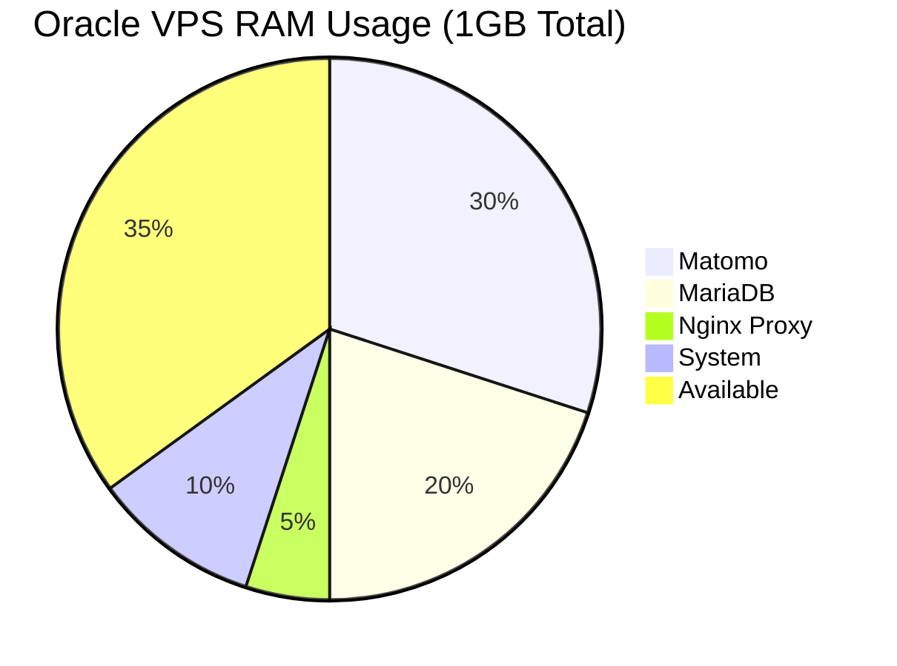

# Cloud Infrastructure Diagram

Visual representation of all VPS instances, VMs, and services.

---

## Infrastructure Tree

```mermaid
graph TD
    subgraph CLOUD["☁️ Cloud Infrastructure"]

        subgraph ORACLE["🟠 Oracle Cloud<br/>Always Free Tier"]
            VPS_ORACLE["📦 VPS Oracle<br/>130.110.251.193<br/>EU-Marseille-1<br/>2 vCPU | 1GB RAM | 50GB"]

            subgraph ORACLE_OS["🖥️ Ubuntu 24.04 LTS"]
                DOCKER_ORACLE["🐳 Docker Engine"]

                subgraph CONTAINERS["Docker Containers"]
                    MATOMO["📊 matomo-app<br/>Matomo Analytics<br/>Port: 8080"]
                    MARIADB["🗄️ matomo-db<br/>MariaDB Database<br/>Port: 3306 internal"]
                    NGINX["🔀 nginx-proxy<br/>Nginx Proxy Manager<br/>Port: 80, 443, 81"]
                end
            end

            subgraph ORACLE_PLANNED["⏳ Planned Services"]
                SYNC_PLAN["🔄 Sync Service<br/>Desktop/Mobile/Garmin"]
                WEB_PLAN["🌐 Web Hosting<br/>Static/Dynamic Sites"]
                MAIL_PLAN["📧 Mail Server<br/>Postfix/Dovecot"]
                DRIVE_PLAN["💾 Drive<br/>Nextcloud"]
            end
        end

        subgraph GCLOUD["🔵 Google Cloud Platform"]
            VPS_GCLOUD["📦 VPS GCloud<br/>gen-lang-client-0167192380<br/>Budget: €5/month"]

            subgraph GCLOUD_SERVICES["GCP Services"]
                BILLING_FUNC["⚡ Cloud Function<br/>billing-disabler<br/>Python 3.11"]
                PUBSUB["📨 Pub/Sub<br/>budget-disable-trigger"]
                BUDGET["💰 Budget Alert<br/>€5/month threshold"]
                N8N["🔧 n8n<br/>Automation Platform"]
            end

            subgraph GCLOUD_OS["🖥️ OS: Arch Linux"]
                ARCH_SYS["System Services"]
            end
        end

        subgraph AI_VPS["🤖 AI Infrastructure"]
            VPS_AI1["📦 VPS AI 1<br/>AI Services"]
            VPS_AI2["📦 VPS AI 2<br/>AI Services"]
        end

    end

    subgraph SERVICES["🔌 Service Domains"]
        S_ANALYTICS["📊 s_analytics<br/>analytics.diegonmarcos.com"]
        S_PROXY["🔀 s_proxy<br/>Reverse Proxy"]
        S_FIREWALL["🛡️ s_firewall<br/>Security"]
        S_DRIVE["💾 s_drive<br/>Cloud Storage"]
        D_SYNC["🔄 d_sync<br/>Data Sync"]
        D_MAIL["📧 d_mail<br/>Email"]
    end

    subgraph EXTERNAL["🌍 External Access"]
        INTERNET["🌐 Internet"]
        DOMAIN["🔗 diegonmarcos.com"]
    end

    %% Connections
    INTERNET --> DOMAIN
    DOMAIN --> NGINX
    NGINX --> MATOMO
    MATOMO --> MARIADB

    BUDGET --> PUBSUB
    PUBSUB --> BILLING_FUNC

    S_ANALYTICS -.-> MATOMO
    S_PROXY -.-> NGINX

    VPS_ORACLE --> ORACLE_OS
    VPS_GCLOUD --> GCLOUD_SERVICES
    VPS_GCLOUD --> GCLOUD_OS
```



---

## Detailed Service Flow

```mermaid
flowchart LR
    subgraph Users["👥 Users"]
        Browser["🌐 Browser"]
        Mobile["📱 Mobile"]
    end

    subgraph DNS["🔗 DNS"]
        Domain["diegonmarcos.com"]
        Analytics["analytics.diegonmarcos.com"]
    end

    subgraph Oracle["🟠 Oracle VPS"]
        subgraph Proxy["Nginx Proxy Manager"]
            SSL["🔒 SSL/TLS<br/>Let's Encrypt"]
            Routing["📍 Routing"]
        end

        subgraph Matomo["Matomo Stack"]
            MatomoApp["📊 Matomo App"]
            MatomoDB["🗄️ MariaDB"]
            AntiBlock["🛡️ Anti-Blocker<br/>collect.php<br/>api.php<br/>track.php"]
        end
    end

    Browser --> Domain
    Mobile --> Domain
    Domain --> SSL
    Analytics --> SSL
    SSL --> Routing
    Routing --> MatomoApp
    Routing --> AntiBlock
    AntiBlock --> MatomoApp
    MatomoApp --> MatomoDB
```



---

## Budget Protection Flow (GCloud)

```mermaid
sequenceDiagram
    participant GCP as GCP Services
    participant Budget as Budget Alert
    participant PubSub as Pub/Sub
    participant Function as Cloud Function
    participant Billing as Billing API

    GCP->>Budget: Spending reaches €5
    Budget->>PubSub: Publish alert message
    PubSub->>Function: Trigger billing-disabler
    Function->>Billing: Disable project billing
    Billing-->>GCP: Services stopped
    Note over GCP: Manual re-enable required
```



---

## Resource Allocation



---

## Network Topology

```mermaid
graph TB
    subgraph Internet["🌐 Internet"]
        Users["Users"]
    end

    subgraph OracleCloud["🟠 Oracle Cloud Security"]
        SecurityList["🛡️ Security Lists<br/>Ports: 22, 80, 443, 81, 8080"]

        subgraph VPS["VPS 130.110.251.193"]
            subgraph DockerNetwork["🐳 Docker Network"]
                NPM["Nginx Proxy<br/>:80 :443 :81"]
                Matomo["Matomo<br/>:8080"]
                DB["MariaDB<br/>:3306"]
            end
        end
    end

    Users -->|HTTPS 443| SecurityList
    Users -->|HTTP 80| SecurityList
    Users -->|Admin 81| SecurityList
    SecurityList --> NPM
    NPM -->|Proxy| Matomo
    Matomo -->|Internal| DB
```



---

## Service Status Legend

| Symbol | Status |
|--------|--------|
| ✅ | Active & Running |
| ⏳ | Planned |
| 🔄 | In Progress |
| ❌ | Disabled/Offline |

---

## Quick Reference

| VPS | Provider | IP/Region | Resources | Purpose |
|-----|----------|-----------|-----------|---------|
| **Oracle** | Oracle Cloud | 130.110.251.193 (EU-Marseille) | 2 vCPU, 1GB RAM, 50GB | Matomo Analytics |
| **GCloud** | Google Cloud | us-east1 | Cloud Functions | Budget Protection, n8n |
| **AI 1** | TBD | TBD | TBD | AI Services |
| **AI 2** | TBD | TBD | TBD | AI Services |

---

## Active Domains

| Domain | Points To | Service |
|--------|-----------|---------|
| `analytics.diegonmarcos.com` | 130.110.251.193 | Matomo Analytics |
| `diegonmarcos.com` | GitHub Pages | Portfolio/Website |

---

## Services Directory

### VPS Oracle (130.110.251.193)

| Service | Status | SSH Access | URL |
|---------|--------|------------|-----|
| **Ubuntu OS** | ✅ | `ssh -i ~/.ssh/matomo_key ubuntu@130.110.251.193` | - |
| **Matomo Analytics** | ✅ | Via OS SSH → `docker exec -it matomo-app bash` | https://analytics.diegonmarcos.com |
| **Matomo (Direct)** | ✅ | Via OS SSH | http://130.110.251.193:8080 |
| **MariaDB** | ✅ | Via OS SSH → `docker exec -it matomo-db bash` | Internal only (:3306) |
| **Nginx Proxy Manager** | ✅ | Via OS SSH → `docker exec -it nginx-proxy bash` | http://130.110.251.193:81 |
| **Anti-Blocker Proxy** | ✅ | Via Matomo container | https://analytics.diegonmarcos.com/collect.php |
| **Sync Service** | ⏳ | - | sync.diegonmarcos.com (planned) |
| **Web Hosting** | ⏳ | - | *.diegonmarcos.com (planned) |
| **Mail Server** | ⏳ | - | mail.diegonmarcos.com (planned) |
| **Drive (Nextcloud)** | ⏳ | - | drive.diegonmarcos.com (planned) |

### VPS GCloud (gen-lang-client-0167192380)

| Service | Status | SSH Access | URL |
|---------|--------|------------|-----|
| **n8n VM** | ✅ | `gcloud compute ssh n8n-vm --zone us-east1-b` | http://[EXTERNAL_IP]:5678 |
| **Cloud Function** | ✅ | - (Serverless) | https://us-east1-gen-lang-client-0167192380.cloudfunctions.net/billing-disabler |
| **Pub/Sub** | ✅ | - (Managed) | - |
| **Budget Alert** | ✅ | - (Managed) | https://console.cloud.google.com/billing |

### VPS AI 1

| Service | Status | SSH Access | URL |
|---------|--------|------------|-----|
| **AI Services** | ⏳ | TBD | TBD |

### VPS AI 2

| Service | Status | SSH Access | URL |
|---------|--------|------------|-----|
| **AI Services** | ⏳ | TBD | TBD |

---

## SSH Quick Reference

```bash
# Oracle VPS (Main server)
ssh -i ~/.ssh/matomo_key ubuntu@130.110.251.193

# Google Cloud n8n VM
gcloud compute ssh n8n-vm --zone us-east1-b

# Get n8n external IP
gcloud compute instances describe n8n-vm --zone us-east1-b --format='get(networkInterfaces[0].accessConfigs[0].natIP)'
```

---

## URL Quick Reference

| Service | URL | Notes |
|---------|-----|-------|
| **Matomo Dashboard** | https://analytics.diegonmarcos.com | Main analytics UI |
| **Nginx Proxy Admin** | http://130.110.251.193:81 | Proxy management |
| **Matomo Direct** | http://130.110.251.193:8080 | Bypass proxy |
| **Anti-Blocker** | https://analytics.diegonmarcos.com/collect.php | Disguised tracking |
| **n8n Automation** | http://[n8n-vm-ip]:5678 | Workflow automation |
| **GCP Console** | https://console.cloud.google.com | Cloud management |
| **Oracle Console** | https://cloud.oracle.com | Cloud management |

---

## Docker Container Access (Oracle VPS)

After SSH to Oracle VPS:

```bash
# Matomo container
docker exec -it matomo-app bash

# MariaDB container
docker exec -it matomo-db bash

# Nginx Proxy container
docker exec -it nginx-proxy bash

# View all containers
docker ps

# View logs
docker compose logs -f matomo-app
docker compose logs -f matomo-db
docker compose logs -f nginx-proxy
```

---

**Last Updated**: 2025-11-26
